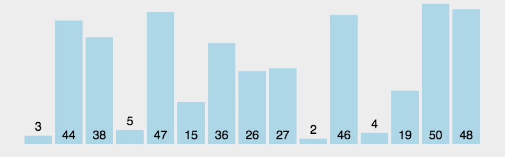

# 冒泡排序

## （1）冒泡排序的介绍

冒泡排序是一种简单的排序算法。它重复地走访过要排序的数列，一次比较两个元素，如果它们的顺序错误就把它们交换过来。走访数列的工作是重复地进行直到没有再需要交换，也就是说该数列已经排序完成。这个算法的名字由来是因为越小的元素会经由交换慢慢“浮”到数列的顶端。

## （2）冒泡排序的原理：

1. 如果元素大小关系不正确，交换这两个数（在本例中为a> b），
2. 比较一对相邻元素（a，b），
3. 重复步骤1和2，直到我们到达数组的末尾（最后一对是第（N-2）和（N-1）项，因为我们的数组从零开始）
4. 到目前为止，最大的元素将在最后的位置。 然后我们将N减少1，并重复步骤1，直到N = 1。

## （3）动图演示



## （4）代码演示

```js
//冒泡排序的基本思想是，对相邻的元素进行两两比较，顺序相反则进行交换，这样，每一趟会将最小或最大的元素“浮”到顶端， 最终达到完全有序。
function bubbleSort(arr) {
  const len = arr.length;
  // 外层循环i控制比较的轮数
  for (let i = 0; i < len; i++) {
    // 里层循环控制每一轮比较的次数j，arr[i] 只用跟其余的len - i个元素比较
    for (let j = 1; j < len - i; j++) {
      // 若前一个元素"大于"后一个元素，则两者交换位置
      if (arr[j - 1] > arr[j]) {
        [arr[j - 1], arr[j]] = [arr[j], arr[j - 1]];
      }
    }
  }
  return arr;
}

// console.log(bubbleSort(arr))	// [1, 2,  5,  7,  7, 8, 9, 12, 34, 39, 56]

//优化冒泡排序
// 优化思路：如果某一轮比较没有发生交换，说明此时数组已经是有序的了，就不需要再进行后续的比较了，直接跳出循环即可。
function bubbleSort2(arr) {
  const len = arr.length;

  for (let i = 0; i < len - 1; i++) {
    let swapped = false;
    for (let j = 0; j < len - i - 1; j++) {
      if (arr[j] > arr[j + 1]) {
        [arr[j], arr[j + 1]] = [arr[j + 1], arr[j]];
        swapped = true;
      }
    }
    if (!swapped) {
      // 如果没有发生交换操作，说明数组已经有序，提前退出循环
      break;
    }
  }

  return arr;
}

function bubbleSort3(arr) {
  if (!Array.isArray(arr) || arr.length <= 1) return arr;

  // 记录数组的长度
  console.log(arr.length);
  let lastIndex = arr.length - 1; // 初始化最后一个元素的索引

  // 当最后一个元素的索引大于 0 时，继续排序
  while (lastIndex > 0) {
    let flag = true; // 设置一个标志位，如果一轮遍历没有发生交换，说明数组已经有序
    let k = lastIndex; // 记录上一轮交换的位置，用于减少比较次数

    // 遍历数组，比较相邻的元素
    for (let j = 0; j < k; j++) {
      if (arr[j] > arr[j + 1]) {
        flag = false; // 如果发生交换，将标志位设为 false
        [arr[j], arr[j + 1]] = [arr[j + 1], arr[j]]; // 交换两个元素的位置
        lastIndex = j; // 更新最后一个交换的位置
      }
    }

    // 如果一轮遍历没有发生交换，说明数组已经有序，可以提前退出循环
    if (flag) break;
  }

  return arr; // 返回排序后的数组
}

const arr = [5, 2, 7, 8, 34, 7, 39, 12, 56, 9, 1];

console.log(bubbleSort3(arr)); // [1, 2,  5,  7,  7, 8, 9, 12, 34, 39, 56]
```
