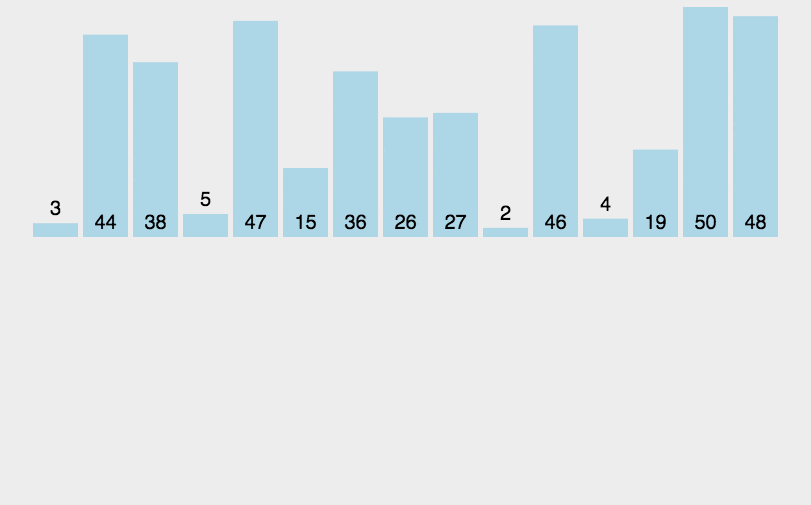

# 归并排序

## （1）归并排序介绍

归并排序（Merge Sort）是一种基于分治思想的排序算法。

它将待排序的数组递归地分成两个子数组，然后对两个子数组分别进行排序，最后将两个有序的子数组合并成一个有序的数组。

## （2）描述

1、将给定的列表分为两半（如果列表中的元素数为奇数，则使其大致相等）。

2、以相同的方式继续划分子数组，直到只剩下单个元素数组。

3、从单个元素数组开始，**合并**子数组，以便对每个合并的子数组进行排序。

4、重复第 3 步单元，直到最后得到一个排好序的数组。

## （3）图片演示



## （4）代码示例

```js
function mergeSort(arr) {
  if (arr.length <= 1) {
    return arr; // 基线条件：数组长度小于等于1，直接返回
  }

  // 将数组分成两个子数组;
  const middle = Math.floor(arr.length / 2);
  const left = arr.slice(0, middle);
  const right = arr.slice(middle);

  // 递归地对两个子数组进行排序
  const sortedLeft = mergeSort(left);
  const sortedRight = mergeSort(right);

  // 合并两个有序的子数组
  return merge(sortedLeft, sortedRight);
}

function merge(left, right) {
  const merged = [];
  let leftIndex = 0;
  let rightIndex = 0;

  // 比较两个子数组的元素，将较小的元素依次放入合并后的数组
  while (leftIndex < left.length && rightIndex < right.length) {
    if (left[leftIndex] <= right[rightIndex]) {
      merged.push(left[leftIndex]);
      leftIndex++;
    } else {
      merged.push(right[rightIndex]);
      rightIndex++;
    }
  }

  // 将剩余的元素放入合并后的数组
  while (leftIndex < left.length) {
    merged.push(left[leftIndex]);
    leftIndex++;
  }

  while (rightIndex < right.length) {
    merged.push(right[rightIndex]);
    rightIndex++;
  }

  return merged;
}

const arr = [5, 2, 7, 8, 34, 7, 39, 12, 56, 9, 1];
console.log(mergeSort(arr)); // [1, 2,  5,  7,  7, 8, 9, 12, 34, 39, 56]
```
