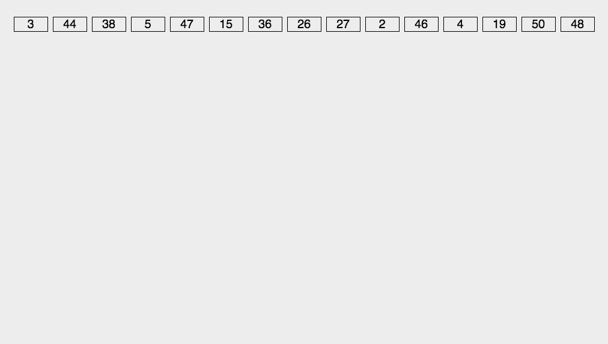

## 基数排序

#### （1）基数排序介绍

 基数排序（Radix Sort）是一种非比较型的排序算法，它将待排序的元素按照个位、十位、百位等位数进行排序。

 基数排序可以应用于整数、字符串等类型的数据。

基数排序的基本思想是从最低有效位（个位）开始，按照位数的顺序依次对元素进行分配和收集，直到最高有效位（最高位）。 在每个位数上，使用稳定的排序算法（如计数排序或桶排序）对元素进行排序。

#### （2）描述

* 取得数组中的最大数，并取得位数；
* arr为原始数组，从最低位开始取每个位组成radix数组；
* 对radix进行计数排序（利用计数排序适用于小范围数的特点）；

#### （3）图片演示



#### （4）代码

```js
// 获取数组中最大值的位数
function getMaxDigit(arr) {
  let max = 0;
  for (let num of arr) {
    const digit = Math.floor(Math.log10(num)) + 1;
    if (digit > max) {
      max = digit;
    }
  }
  return max;
}

// 基数排序
function radixSort(arr) {
  const maxDigit = getMaxDigit(arr); // 获取最大位数
  let mod = 10;
  let dev = 1;

  for (let i = 0; i < maxDigit; i++, dev *= 10, mod *= 10) {
    // 使用计数排序对当前位数进行排序
    countingSort(arr, dev, mod);
  }

  return arr;
}

// 计数排序
function countingSort(arr, dev, mod) {
  const count = new Array(10).fill(0);

  // 统计当前位数的频次
  for (let num of arr) {
    const digit = Math.floor((num % mod) / dev);
    count[digit]++;
  }

  // 计算累计频次
  for (let i = 1; i < count.length; i++) {
    count[i] += count[i - 1];
  }

  const output = new Array(arr.length);

  // 从后向前遍历原数组，根据当前位数的值确定元素的位置
  for (let i = arr.length - 1; i >= 0; i--) {
    const num = arr[i];
    const digit = Math.floor((num % mod) / dev);
    const index = count[digit] - 1;
    output[index] = num;
    count[digit]--;
  }

  // 将排好序的结果复制回原数组
  for (let i = 0; i < arr.length; i++) {
    arr[i] = output[i];
  }
}

const arr = [5, 2, 7, 8, 34, 7, 39, 12, 56, 9, 1, '6', '18', 10, '11'];
console.log(radixSort(arr)); // [1, 2, 5, 7, 7, 8, 9, 12, 34, 39, 56]
```
