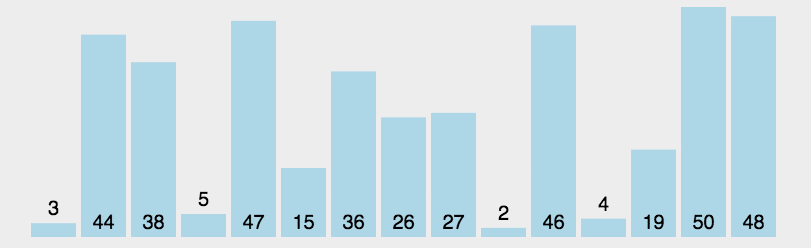

# 选择排序

## （1）选择排序的介绍

选择排序（Selection Sort）是一种简单直观的排序算法。它的基本思想是从待排序的数组中选择最小（或最大）的元素，

将其放置在已排序序列的末尾，然后再从剩余未排序的元素中选择最小（或最大）的元素，放置在已排序序列的末尾，

依此类推，直到整个数组排序完成。选择排序的基本思想为每一趟从待排序的数据元素中选择最小（或最大）的一个元素作为首元素，直到所有元素排完为止。

## （2）选择排序的原理

1. 在 **[L ... N-1]** 范围内找出最小项目 **X** 的位置，
2. 用第 **L** 项交换X，
3. 将下限 **L** 增加1并重复步骤1直到 **L = N-2**。

## （3）动态图演示



## （4）代码演示

```js
const arr = [1, 15, 7, 8, 34, 7, 39, 12, 56, 9, 5];

function selectionSort(arr) {
  const len = arr.length;
  for (let i = 0; i < len - 1; i++) {
    let minIndex = i;
    // 在未排序部分中找到最小元素的索引
    for (let j = i + 1; j < len; j++) {
      if (arr[j] < arr[minIndex]) {
        minIndex = j;
      }
    }

    // 将找到的最小元素与未排序部分的第一个元素交换位置
    if (minIndex !== i) {
      [arr[i], arr[minIndex]] = [arr[minIndex], arr[i]];
    }
  }

  return arr;
}

console.log(selectionSort(arr));
```
