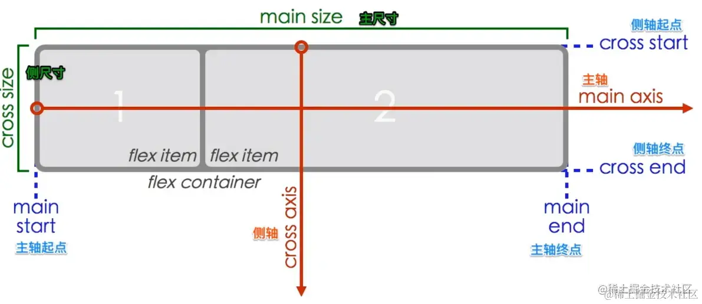
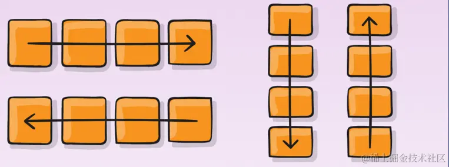
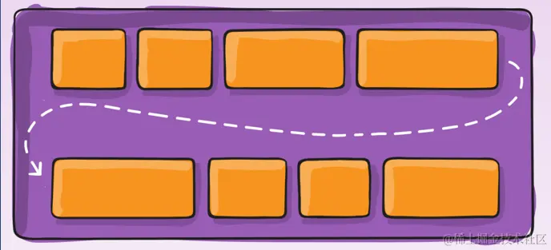
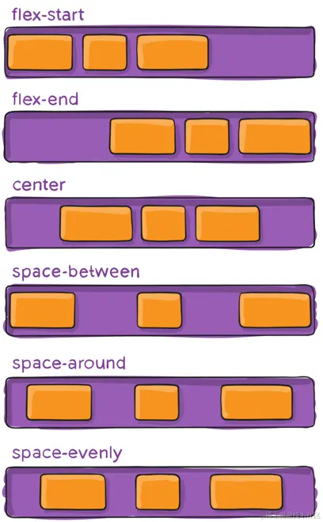
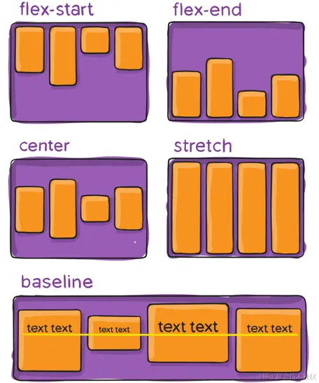
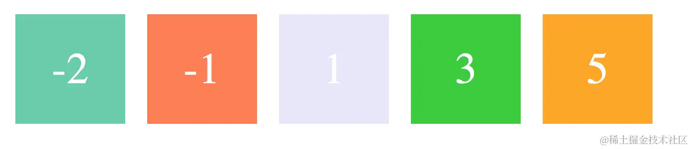
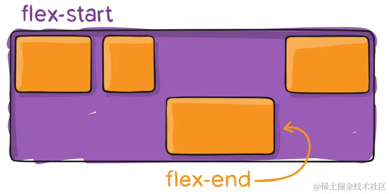

# flex布局
*   container 容器(一般用来做父元素)
*   items 项目（一般用来做子元素）



## 容器的属性

首先，实现 flex 布局需要先指定一个容器，任何一个容器都可以被指定为 flex 布局，这样容器内部的元素就可以使用 flex 来进行布局。\
flex： 将对象作为弹性伸缩盒显示, 没有为父元素main设置宽度，默认为100%；\
inline-flex：将对象作为内联块级弹性伸缩盒显示，没有给父元素设置宽度，但是父元素默认会根据子元素的宽高去自适应。

```css
.container {
  display: flex | inline-flex; //可以有两种取值
}
```

分别生成一个块状或行内的 flex 容器盒子。简单说来，如果你使用块元素如 div，你就可以使用 flex，而如果你使用行内元素，你可以使用 inline-flex。

**需要注意的是：当时设置 flex 布局之后，子元素的 float、clear、vertical-align 的属性将会失效。**

### flex-direction: 决定主轴的方向(即项目的排列方向)

```css
.container {
  flex-direction: row | row-reverse | column | column-reverse;
}
```

默认值：row，主轴为水平方向，起点在左端。



### flex-wrap: 决定容器内项目是否可换行

默认情况下，项目都排在主轴线上，使用 flex-wrap 可实现项目的换行。

```css
.container {
  flex-wrap: nowrap | wrap | wrap-reverse;
}
```

默认值：nowrap 不换行，即当主轴尺寸固定时，当空间不足时，项目尺寸会随之调整而并不会挤到下一行。



### flex-flow

`flex-flow`  属性是  `flex-direction`  属性和  `flex-wrap`  属性的简写形式，默认值为  `row nowrap`

默认值为: row nowrap，感觉没什么卵用，老老实实分开写就好了。这样就不用记住这个属性了。

```css
flex-flow: <flex-direction>|| <flex-wrap>;
```

### justify-content：定义了项目在主轴的对齐方式。

```css
.container {
  justify-content: flex-start | flex-end | center | space-between | space-around;
}
```

**建立在主轴为水平方向时测试，即 flex-direction: row**
*   `flex-start`（默认值）：左对齐

*   `flex-end`：右对齐

*   `center`： 居中

*   `space-between`：两端对齐，项目之间的间隔都相等。
*    `space-around`：每个项目两侧的间隔相等。

*   `space-evenly`：每个项目的间隔与项目和容器之间的间隔是相等的。



### align-items: 定义了项目在交叉轴上的对齐方式

```css
.container {
  align-items: flex-start | flex-end | center | baseline | stretch;
}
```

**建立在主轴为水平方向时测试，即 flex-direction: row**
*   `flex-start`：交叉轴的起点对齐。
*   `flex-end`：交叉轴的终点对齐。
*   `center`：交叉轴的中点对齐。

*   `stretch`（默认值）: 如果项目未设置高度或设为auto，将占满整个容器的高度。
*   `baseline`: 项目的第一行文字的基线对齐。



### align-content

`align-content` 属性定义了多根轴线的对齐方式，前提是需要设置flex-wrap: wrap，否则不会有效

```css
align-content: flex-start | flex-end | center | space-between | space-around | stretch;
```

*   `flex-start`：与交叉轴的起点对齐。
*   `flex-end`：与交叉轴的终点对齐。
*   `center`：与交叉轴的中点对齐。
*   `stretch`（默认值）：轴线占满整个交叉轴。
*   `space-between`：与交叉轴两端对齐，轴线之间的间隔平均分布。
*   `space-around`：每根轴线两侧的间隔都相等。

## items属性

### order

`order`  属性定义项目的排列顺序。数值越小，排列越靠前，默认为0，可以是负数。



###  flex-grow

**定义项目的放大比例**

`flex-grow`  flex容器中剩余空间的多少应该分配给项目，也称为扩展规则。最终的项目的宽度为：自身宽度 + 容器剩余空间分配宽度，flex-grow最大值是1，超过1按照1来扩展
items上加flex-grow（控制变胖）

```css
.items {
  flex-grow: 0;
}
```

### flex-shrink

items上加flex-shrink（控制变瘦，一般写flex-shrink：0防止变瘦，默认是1）

```css
.items {
  flex-shrink: 0;
}
```

### flex-basis

items上加flex-basis（控制基本宽度，默认auto） flex：flex-grow flex-gshrink flex-basis(缩写)

```css
.items {
  flex: 1 1 100px;
}
```

### align-self

align-self定制align-items（某一个items可以特立独行，不常用）

```css
.item {
  align-self: auto | flex-start | flex-end | center | baseline | stretch;
}
```



## 重点属性

*   `display: flex`让一个元素变成flex容器
*   `flex-direction: row/column`表示流动方向横着还是竖着
*   `flex-wrap: wrap`是否换行
*   `justify-content: conter/space-between`主轴（横轴）方向怎么对齐
*   `align-items: center`次轴（纵轴）方向怎么对齐

[代码片段](https://code.juejin.cn/pen/7140893739521671179)
