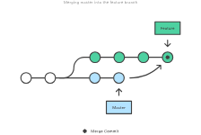
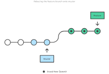
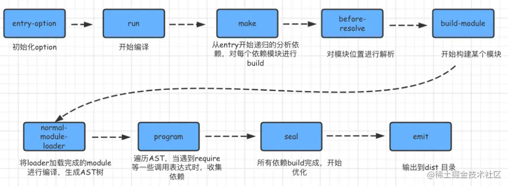

# 工程化

## 常用的git命令

::: details
Git 是一个常用的版本控制工具，以下是一些常用的 Git 命令：

### 创建和配置仓库：

* **git init：** 在当前目录创建一个新的 Git 仓库。
* **git clone [url]：** 克隆远程仓库到本地。
* **git config：** 配置 Git，包括用户名、邮箱等信息。

### 基本操作：

* **git add [file]：** 将文件添加到暂存区。
* **git commit -m "message"：** 将暂存区的文件提交到本地仓库。
* **git status：** 查看工作区、暂存区和本地仓库的状态。
* **git diff：** 查看文件更改的具体内容。

### 分支管理：

* **git branch：** 查看当前分支。
* **git branch [branch-name]：** 创建新的分支。
* **git checkout [branch-name]：** 切换分支。
* **git merge [branch-name]：** 合并指定分支到当前分支。

### 远程仓库操作：

* **git remote add origin [url]：** 添加远程仓库。
* **git push origin [branch-name]：** 将本地分支推送到远程仓库。
* **git pull origin [branch-name]：** 拉取远程仓库的变更到本地。
* **git fetch：** 从远程仓库获取最新代码但不合并。

### 撤销和修改：

* **git reset [file]：** 撤销文件的暂存状态。
* **git checkout -- [file]：** 恢复文件到最近的提交状态。
* **git revert [commit]：** 撤销指定提交的修改。

### 日志和查看：

* **git log：** 查看提交日志。
* **git show [commit]：** 查看指定提交的详细信息。
* **git blame [file]：** 显示文件的每一行是谁在什么时候修改的。

这些是 Git 中最常用的命令，每个命令都有自己的参数和用法，根据具体情况选择合适的命令进行版本控制和管理。
:::

## git rebase和git merge的区别

::: details
`git rebase` 和 `git merge` 都是用于合并分支的 Git 命令，但它们的工作方式和结果有所不同：

### 1. Git Merge：

* **工作方式：** 在合并分支时，Git 会创建一个新的提交（merge commit），将两个分支的修改合并到一个新的提交中。

* **提交历史：** 在提交历史中，会保留原始分支和合并产生的新提交的信息，因此可以清晰地看到分支的合并历史。

* **优点：** 保留了分支的整个历史记录，易于理解分支之间的关系。



```bash
# 合并分支到当前分支
git merge <branch-name>
```

### 2. Git Rebase：

* **工作方式：** 将当前分支上的修改“挪动”到目标分支的最后，看起来好像是在目标分支上进行的修改，不会创建新的合并提交。

* **提交历史：** 使用 rebase 会改写提交历史，将当前分支上的提交放到目标分支的后面，形成线性的提交历史。

* **优点：** 保持了提交历史的线性性，减少了分支合并后的混乱提交历史。



```bash
# 将当前分支的修改“挪动”到目标分支的最后
git rebase <branch-name>
```

### 如何选择：

* 使用 `git merge` 保留了分支之间的合并信息，适合公共分支或多人协作的情况，更易于追踪分支的历史。

* 使用 `git rebase` 可以保持提交历史的整洁和线性，适合在私有分支上工作，减少冗杂的合并提交。

**重要提示：** 在对公共分支进行操作时，如 master 或其他共享分支，最好避免使用 rebase，因为它会改写提交历史，可能造成他人的困扰。
:::
 ## webpack的构建流程



## 常见 loader 和 plugin 有哪些？二者的区别是什么？

Webpack 的生态系统提供了许多加载器（Loaders）和插件（Plugins），用于处理不同类型的文件、优化构建、提高开发效率等。以下是一些常见的 Loader 和 Plugin：
::: details

### 常见的 Loader：

1. **babel-loader：** 将 ES6/ES7 代码转换为兼容的 ES5 代码。
2. **style-loader 和 css-loader：** 处理 CSS 文件，使其能够被 JavaScript 引入并注入到页面中。
3. **file-loader 和 url-loader：** 处理图片、字体等静态文件，生成文件 URL 或将小文件转换为 Data URL。
4. **sass-loader 和 less-loader：** 处理 Sass 和 Less 文件，将其编译为 CSS。
5. **ts-loader：** 处理 TypeScript 文件，将其编译为 JavaScript。
6. **postcss-loader：** 使用 PostCSS 处理 CSS，可以使用各种插件进行自动添加前缀、压缩等。
7. **eslint-loader 和 stylelint-loader：** 在构建过程中进行代码风格和质量检查。

### 常见的 Plugin：

1. **HtmlWebpackPlugin：** 自动生成 HTML 文件，并自动引入打包后的 JS、CSS 文件。
2. **MiniCssExtractPlugin：** 将 CSS 提取为单独的文件，而不是以 `<style>` 标签嵌入到 HTML 文件中。
3. **CleanWebpackPlugin：** 清理构建目录，保证每次构建前都是干净的。
4. **HotModuleReplacementPlugin：** 热模块替换，用于在开发环境下实现热更新。
5. **CopyWebpackPlugin：** 复制静态资源到输出目录。
6. **DefinePlugin：** 定义全局变量，用于在编译时创建全局常量。
7. **WebpackBar：** 美化构建进度显示。
8. **BundleAnalyzerPlugin：** 生成构建分析报告，用于分析打包文件的大小和依赖。

这些 Loader 和 Plugin 可以根据项目需求选择并配置，通过它们的组合和定制，能够有效地优化构建过程、提高开发效率和应用性能。

### 二者的区别

* loader 是文件加载器（这句废话很重要）
  + Loaders 可以将各种文件（如 JavaScript、CSS、图片、字体等）转换为模块，使其可以被引入到应用程序中，以及在构建过程中进行转换和处理
  + Loaders 是在模块加载时应用的，作用于单个文件
  + Loaders 在配置文件中的 module.rules 下配置

* plugin 是 webpack 插件
  + Plugins 可以处理更广泛的任务，如优化、压缩、代码分割、生成 HTML 文件、资源管理等，甚至可以在构建周期中执行自定义的操作
  + Plugins 则作用于整个构建过程，能够在构建周期的不同阶段执行任务
  + Plugins 在 plugins 数组中配置

:::

## webpack proxy工作原理？为什么能解决跨域

::: details

### Webpack Dev Server 的 Proxy 配置：

Webpack Dev Server 提供了 `proxy` 选项，允许开发者在开发环境中配置代理，将特定的 API 请求代理到后端服务器，以解决跨域请求的问题。

```js
module.exports = {
  //...
  devServer: {
    proxy: {
      '/api': {
        target: 'http://xiedaimala.com',
        changeOrigin: true,
      },
    },
  },
};
```

### 工作原理：

1. **开发环境配置：** 在开发环境下，前端和后端通常运行在不同的端口上，而浏览器的同源策略会阻止跨域请求。使用 Webpack Dev Server 的代理配置，可以将前端发起的请求代理到后端服务器，绕过浏览器的同源策略。

2. **代理转发：** 当前端发起请求时，Webpack Dev Server 会根据配置的代理规则拦截匹配的请求，并将这些请求转发到后端服务器上。后端服务器接收到这些请求并返回相应的数据，Webpack Dev Server 再将数据返回给前端，完成跨域请求。

### 解决跨域问题的原理：

* **同源策略：** 浏览器出于安全考虑，实施了同源策略，限制了不同源之间的交互，包括 JavaScript 的跨域请求。但代理服务器在后端发起请求，不受同源策略的限制，因此可以实现前端跨域请求到代理服务器，再由代理服务器向后端发起请求，最终绕过了浏览器的同源限制。

* **代理服务器：** 在开发环境下，Webpack Dev Server 充当了一个代理服务器的角色，将前端请求转发到后端，从而解决了跨域请求的问题。

Webpack Dev Server 的代理配置为开发环境下的跨域问题提供了解决方案，但在生产环境中，跨域请求通常需要由服务器端配置 CORS（跨源资源共享）等策略来实现。
:::

## webpack 与 vite 的区别是什么？

::: details

[vite 相比webpack的优缺点。 - 掘金 (juejin.cn)](https://juejin.cn/post/7039224502655402021?searchId=202307131108228B388F0A3F60244A9766#heading-6)

#### Webpack

* Webpack 是一个基于依赖图的静态模块打包工具，可以处理各种类型的文件，并且支持各种功能，如代码分割、模块化、加载器和插件等
* Webpack *使用 *babel *来打包 JS 代码，Webpack 在每次文件修改后都需要重新编译整个应用，因此在大型项目中可能会导致启动速度较慢
* Webpack 是一个成熟且广泛使用的前端打包工具，具有丰富的生态系统和大量的社区支持，适用于各种类型的项目

#### Vite

* vite 使用 *rollup *+ *esbuild *来打包 JS 代码, 旨在提供更快的开发启动和热更新速度
* Vite 使用 ES Modules 原生支持浏览器的导入规范，利用现代浏览器对 ES Modules 的支持，可以更快地实现按需编译和模块热更新

<!---->

目前已知 vite 的缺点有：

1.  热更新常常失败，原因不清楚

<!---->

2.  有些功能 rollup 不支持，需要自己写 rollup 插件

<!---->

3.  不支持非现代浏览器
:::

## 性能优化

[performance](./performance)
