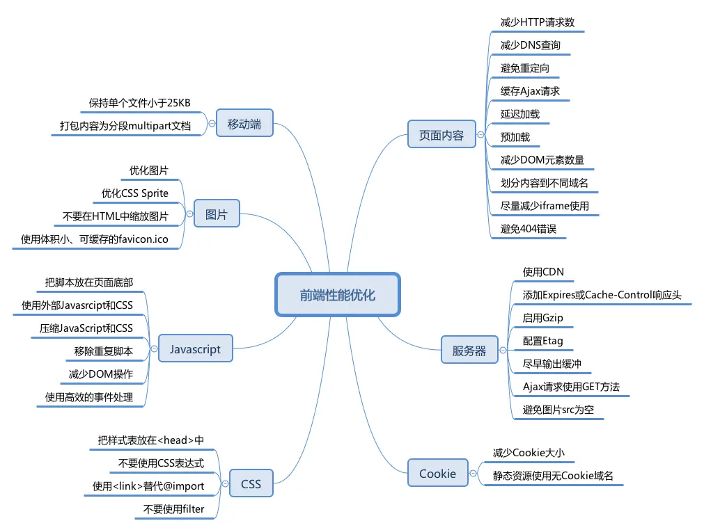

# 性能优化



## 网络优化

::: details

### DNS预解析

*   当我们输入url访问一个网页后，第一步会进行DNS查询，通过DNS得到IP地址。
*   想让DNS查询更快，可以花钱购买一些更快的DNS服务，但没有必要。
*   一般是配置hosts，自己把ip配置好。DNS就会读取系统hosts文件，查找其中是否有对应的ip。 使用HTML头部的<link rel='dns-prefetch' href='…' />可以帮助你提前获取DNS记录

### 使用CDN

静态css/js/img等资源可以做cdn缓存，这样把资源同步到全国全球各地，用户就能更快访问到

### 浏览器缓存

:::

## 代码压缩

::: details

### 开启 gzip 压缩

`gzip` 是 `GNUzip` 的缩写，最早用于 UNIX 系统的文件压缩。HTTP 协议上的 `gzip` 编码是一种用来改进 web 应用程序性能的技术，Web 服务器和客户端（浏览器）必须共同支持 `gzip` 。目前主流的浏览器，Chrome，firefox，IE等都支持该协议。常见的服务器如 Apache，Nginx，IIS 同样支持， `gzip` 压缩效率非常高，通常可以达到 70% 的压缩率，也就是说，如果你的网页有 30K，压缩之后就变成了 9K 左右

### Webpack 压缩

在 webpack 可以使用如下插件进行压缩：

*   JavaScript：`UglifyPlugin`
*   CSS ：`MiniCssExtractPlugin`
*   HTML：`HtmlWebpackPlugin`
:::

## JavaScript中的性能优化

::: details

### 防抖和节流（resize，scroll，input）。

### 使用事件委托（简化DOM操作）

```html
<ul>
  <li> 苹果 </li>
  <li> 香蕉 </li>
  <li> 凤梨 </li>
</ul> ​
<script>
  // good
  document.querySelector('ul').onclick = (event) => {
    const target = event.target
    if (target.nodeName === 'LI') {
      console.log(target.innerHTML)
    }
  }​
  // bad
  document.querySelectorAll('li').forEach((e) => {
    e.onclick = function() {
      console.log(this.innerHTML)
    }
  })
</script>
```

### css 放 ，js 脚本放 最底部。

*   由于用户浏览网页是先看再进行操作，所以先把css加载出来有利于客户的使用体验。

延迟JavaScript

`defer` 属性告诉浏览器在 HTML 解析器解析完文档之后运行脚本，但在事件发生之前， `DOMContentLoaded` 会被触发。
:::

## 页面渲染优化

::: details

### 避免CSS、JS阻塞

### 使用字体图标 iconfont 代替图片图标

字体图标就是将图标制作成一个字体，使用时就跟字体一样，可以设置属性，例如 font-size、color 等等，非常方便。并且字体图标是矢量图，不会失真

### 降低 CSS 选择器的复杂性

1.  减少嵌套。后代选择器的开销是最高的，因此我们应该尽量将选择器的深度降到最低（最高不要超过三层），尽可能使用类来关联每一个标签元素
1.  关注可以通过继承实现的属性，避免重复匹配重复定义
1.  尽量使用高优先级的选择器，例如 ID 和类选择器。
1.  避免使用通配符，只对需要用到的元素进行选择

### 减少回流（重排）和重绘。

#### 7.4.1 重绘 (Repaint)

当页面中元素样式的改变并不影响它在文档流中的位置时（例如：color、background-color、visibility等），浏览器会将新样式赋予给元素并重新绘制它，这个过程称为重绘

#### 7.4.2 回流 (Reflow)

当Render Tree中部分或全部元素的尺寸、结构、或某些属性发生改变时，浏览器重新渲染部分或全部文档的过程称为回流。

**回流必将引起重绘，重绘不一定会引起回流，回流比重绘的代价要更高。**

## 图片资源优化

### 使用雪碧图

雪碧图的作用就是减少请求数，而且多张图片合在一起后的体积会少于多张图片的体积总和，这也是比较通用的图片压缩方案

### 图片懒加载

在图片即将进入可视区域的时候进行加载（判断图片进入可视区域请参考[这里](https://juejin.cn/post/7178783712363708475#heading-28)）

### 使用CSS3代替图片

有很多图片使用 CSS 效果（渐变、阴影等）就能画出来，这种情况选择 CSS3 效果更好

### 图片压缩

压缩方法有两种，一是通过在线网站进行压缩，二是通过 webpack 插件 image-webpack-loader。它是基于 [imagemin](https://link.juejin.cn/?target=https%3A%2F%2Flink.segmentfault.com%2F%3Fenc%3D6SFBEjb9%2FrzIZGfOUStOJw%3D%3D.%2Bf0Zw4j1CQG%2B3h9FDEUcmMrWACqiCYz06EmP4BxMagRAdgpHKY5LqwmVWYq9L%2FENvVhS9SUbVatpPn6kZMHKp%2B%2FxXnsenceQ5QcMKwcb8ks%3D) 这个 Node 库来实现图片压缩的。

#### 使用 webp 格式的图片

`WebP` 是 Google 团队开发的加快图片加载速度的图片格式，其优势体现在它具有更优的图像数据压缩算法，能带来更小的图片体积，而且拥有肉眼识别无差异的图像质量；同时具备了无损和有损的压缩模式、Alpha 透明以及动画的特性，在 JPEG 和 PNG 上的转化效果都相当优秀、稳定和统一。
:::

## Webpack 优化

::: details
*   `减小代码体积`
*   `babel-plugin-transform-runtime`减少ES6转化ES5的冗余
*   `按需加载`
*   `提取第三库代码`
*   `模板预编译`
*   `webpack dll优化`
:::
