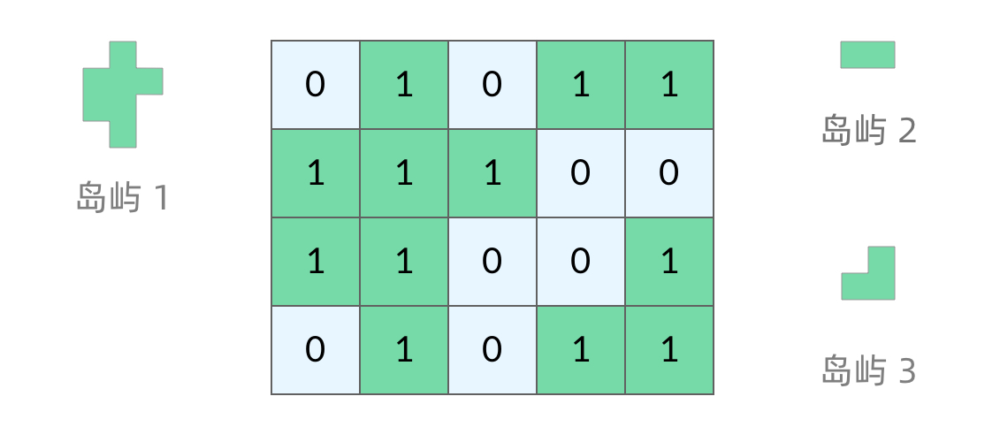

# 每日算法

[根据大佬这个仓库](https://github.com/hovinghuang/fe-agorithm-interview)来准备算法面试

## 字符串相加（大数加法）:star:

 * [leetcode 题目](https://leetcode-cn.com/problems/add-strings/)

::: details
* 创建指针 *i* 指向 nums1 末位数字，*j* 指向 nums2 末位数字。
* *i*, *j* 数字相加，用进位就用 carry 来记录进位值，无则为 0。
* 若产生进位，则当前数字为 (*i* + *j*)%10 的值。
* 若遍历过程中，nums1 或 nums2 当前已无数字，则用 0 补位来计算。

```JS
/**
 * @param {string} num1
 * @param {string} num2
 * @return {string}
 */
var addStrings = function(num1, num2) {
  let i = num1.length - 1,
    j = num2.length - 1,
    carry = 0,
    ans = [];
  while (i >= 0 || j >= 0 || carry !== 0) {
    let c1 = i >= 0 ? num1[i] - '0' : 0,
      c2 = j >= 0 ? num2[j] - '0' : 0;
    let sum = c1 + c2 + carry;
    ans.unshift(sum % 10);
    carry = Math.floor(sum / 10);
    i--;
    j--;
  }
  return ans.join('');
}
```

:::

## 两数之和 :star:

 * [leetcode 题目](https://leetcode-cn.com/problems/two-sum/)

::: details

### 双循环

* 第一次接触题目，首先肯定是想到暴力解法，通过双循环遍历数组，找nums[i] + nums[j] === target。
* 时间复杂度: O(n^2)
* 空间复杂度: O(1)

```JS
/**
 * @param {number[]} nums
 * @param {number} target
 * @return {number[]}
 */
var twoSum = function(nums, target) {
  let res = []
  for (let i = 0, len = nums.length; i < len; i++) {
    let dif = target - nums[i]
    // 因为同一元素不允许重复出现，所以从i的下一位开始遍历
    for (let j = i + 1; j < len; j++) {
      if (nums[j] === dif) {
        res = [i, j];
        return res
      }
    }
  }
  // 所有样例都是有返回结果的，这里无所谓
  return res;

};
```

### 哈希表

 * 思路：遍历的同时借助哈希表，记录值和下标
 * 时间复杂度：O(n)，最多遍历数组一遍，每次查询哈希表都是O(1)
 * 空间复杂度：O(n)，最坏情况下找到数组结尾才找到，其他都加入哈希表，哈希表最长 n - 1

```JS
var twoSum = function(nums, target) {
  let map = new Map();
  for (let i = 0, len = nums.length; i < len; i++) {
    let dif = target - nums[i]
    if (map.has(dif)) {
      return [map.get(dif), i];
    } else {
      map.set(nums[i], i);
    }
  }
  return [];
};
```

:::

## 无重复字符的最长子串 :star:

* 题目名称：无重复字符的最长子串（类似题目：最长无重复子数组）
* [leetcode 题目](https://leetcode-cn.com/problems/longest-substring-without-repeating-characters/)

::: details

#### 解法一：滑动窗口（reduce累加器）

* 思路：
* （1）先判断字符串 s 的长度，如果 s.length <= 1 直接返回 s.length
* （2）将字符串 s 转成数组，这样就可以用数组的 reduce 累加器
* （3）reduce 滑动窗口过程处理（详细过程看以下代码），返回最长子串的长度 maxLen
* 时间复杂度：O(n)，n 代表字符串长度，reduce 会将字符串的每一个字符都遍历一遍
* 空间复杂度：O(n)，n 代表字符串长度，将字符串转成了数组（额外空间）

```JS
function lengthOfLongestSubstring(s: string): number {
  if (s.length <= 1) return s.length

  let maxLen = 0
  const strArr = s.split('')

  strArr.reduce((total, value) => {
    console.log(total, value)
    const index = total.indexOf(value)
    // 拼接到 total 尾部
    total += value
    if (index === -1) {
      // 如果该字符没有在 total 中出现过，获取目前为止滑动窗口的最大值
      maxLen = Math.max(total.length, maxLen)
    } else {
      // 如果该字符有在 total 中出现过，则剔除掉 total 中 0 ~ index 的字符
      total = total.slice(index + 1)
    }

    return total
  }, '')

  return maxLen

};
```

#### 解法二：滑动窗口（双指针&哈希）

* 思路：
* （1）先判断字符串 s 的长度，如果 s.length <= 1 直接返回 s.length
* （2）窗口左右界都从数组首部开始，每次窗口优先右移右界，并统计进入窗口的元素的出现频率。
* （3）一旦右界元素出现频率大于1，就需要右移左界直到窗口内不再重复，将左边的元素移除窗口的时候
*     同时需要将它在哈希表中的频率减1，保证哈希表中的频率都是窗口内的频率。
* （4）每轮循环维护最长子串的长度 maxLen
* 时间复杂度：O(n)，外循环窗口右界从数组首右移到数组尾，内循环窗口左界同样如此，因此复杂度为O(n + n) = O(n)
* 空间复杂度：O(n)，最坏情况整个数组都是不重复的，哈希表的长度就是数组长度

```JS
function lengthOfLongestSubstring(s: string): number {

  if (s.length <= 1) return s.length

  let maxLen = 0
  const map = new Map()

  // 设置窗口左右边界
  for (let left = 0, right = 0; right < s.length; right++) {
    if (map.has(s[right])) {
      // 窗口右移进入哈希表统计次数
      map.set(s[right], map.get(s[right]) + 1)
    } else {
      map.set(s[right], 1)
    }

    // 出现次数大于1，则窗口内有重复
    while (map.get(s[right]) > 1) {
      // 窗口左移，同时减去该数字出现的次数
      map.set(s[left], map.get(s[left++]) - 1)
    }

    maxLen = Math.max(maxLen, right - left + 1)
  }

  return maxLen

};
```

:::

## 合并两个有序数组

* [leetcode 题目](https://leetcode-cn.com/problems/merge-sorted-array/)
* [leetcode 题解](https://leetcode-cn.com/problems/merge-sorted-array/solution/by-hovinghuang-58f6/)
* [牛客网 题目](https://www.nowcoder.com/practice/89865d4375634fc484f3a24b7fe65665?tpId=295&tqId=658&ru=/exam/oj&qru=/ta/format-top101/question-ranking&sourceUrl=%2Fexam%2Foj%3Ftab%3D%25E7%25AE%2597%25E6%25B3%2595%25E7%25AF%2587%26topicId%3D295)
* [牛客网 题解](https://blog.nowcoder.net/n/950d8331e9004749adc1a3d98a5ec29f)
::: details

### 解法一：JS Sort

* 思路：
* （1）先判断 B 为空直接 return，A 为空则将 B shift 到 A 中
* （2）将 B shift 填到 A 尾部的扩容区域，然后用 sort 排序
* 时间复杂度：O(nlogn)， JS sort 方法基于快速排序实现
* 空间复杂度：O(1)，常数级变量，无额外空间

```JS
export function merge(A: number[], m: number, B: number[], n: number) {

  for (let i = m; i < m + n; i++) {
    A[i] = B.shift()
  }

  // 升序排列
  A.sort((a, b) => a - b)
}
```

 ### 解法二：双指针
 * 思路：
 * （1）先判断 B 为空直接 return，A 为空则将 B shift 到 A 中
 * （2）使用三个指针，len1 指向数组 A 的最大元素，len2 指向数组B的最大元素，len 指向数组A空间的结尾处。
 * （3）从两个数组最大的元素开始遍历，直到某一个结束，每次取出较大的一个值放入数组 A 空间的最后，然后指针依次往前。
 * （4）如果数组 B 先遍历结束，数组 A 前半部分已经存在了，不用管; 但是如果数组 A 先遍历结束，则需要把数组 B 剩余的前半部分依次逆序加入数组 A 前半部分
 * 时间复杂度：O(m + n)，最坏情况遍历整个数组 A 和 数组 B
 * 空间复杂度：O(1)，常数级变量，无额外空间

```JS
export function merge(A: number[], m: number, B: number[], n: number) {
  let aIndex: number = m - 1;
  let bIndex: number = n - 1;
  let mIndex: number = m + n - 1;

  while (aIndex >= 0 && bIndex >= 0) {
    if (A[aIndex] >= B[bIndex]) {
      A[mIndex--] = A[aIndex--];
    } else {
      A[mIndex--] = B[bIndex--];
    }
  }

  while (bIndex >= 0) {
    A[mIndex--] = B[bIndex--];
  }
}
```

:::

 ## 比较版本号
 * [leetcode 题目](https://leetcode-cn.com/problems/compare-version-numbers/)
 * [leetcode 题解](https://leetcode-cn.com/problems/compare-version-numbers/solution/by-hovinghuang-rmlf/)
 * [牛客网 题目](https://www.nowcoder.com/practice/2b317e02f14247a49ffdbdba315459e7)
 * [牛客网 题解](https://blog.nowcoder.net/n/5569dbf30e3e45ea977152a629d86439)
::: details
 * 解法一：分割截取
 * 思路：
 *（1）先根据. 号分割成字符串数组，获取两个数组中的最大长度值，
 *（2）按顺序遍历比较，详细过程看以下代码
 * 时间复杂度：O(max(n, m))
 * 空间复杂度：O(max(n, m))

```JS
/**
 * @param {string} version1
 * @param {string} version2
 * @return {number}
 */
var compareVersion = function(version1, version2) {
  const v1 = version1.split(".");
  const v2 = version2.split(".");

  const maxLen = Math.max(v1.length, v2.length);
  for (let i = 0; i < maxLen; i++) {
    // arr1[i] - '0' ，js 会强制转换成 number 然后相减
    // 例如：（'01' - '0'）， 结果是 1 （number 类型）
    const num1 = v1[i] ? v1[i] - "0" : 0;
    const num2 = v2[i] ? v2[i] - "0" : 0;
    if (num1 > num2) {
      return 1;
    } else if (num1 < num2) {
      return -1;
    }
  }
  return 0;

}
```

:::

## 有效括号序列

 * [leetcode 题目](https://leetcode-cn.com/problems/valid-parentheses/)
 * [leetcode 题解](https://leetcode-cn.com/problems/valid-parentheses/solution/by-hovinghuang-6gz1/)
 * [牛客网 题目](https://www.nowcoder.com/practice/37548e94a270412c8b9fb85643c8ccc2?tpId=295&tqId=726&ru=/exam/oj&qru=/ta/format-top101/question-ranking&sourceUrl=%2Fexam%2Foj%3Ftab%3D%25E7%25AE%2597%25E6%25B3%2595%25E7%25AF%2587%26topicId%3D295)
 * [牛客网 题解](https://blog.nowcoder.net/n/620e933e59534064a9722bfa6da0c3d0)
::: details
* 🧠思路
* 有效括号字符串的长度，一定是偶数！
* 右括号前面，必须是相对应的左括号，才能抵消！
* 右括号前面，不是对应的左括号，那么该字符串，一定不是有效的括号！
* 时间复杂度：O(n)，其中 n 为字符串长度
* 空间复杂度：O(n+∣Σ∣)，其中 Σ 表示字符集，本题中字符串只包含 6 种括号，∣Σ∣=6|。栈中的字符数量为 O(n)，而哈希表使用的空间为 O(∣Σ∣)，相加即可得到总空间复杂度。

```JS
/**
 * @param {string} s
 * @return {boolean}
 */
var isValid = function(s) {
  s = s.split('');
  let sl = s.length;
  if (sl % 2) return false;
  let map = new Map([
    [')', '('],
    [']', '['],
    ['}', '{']
  ]);
  let stack = [];
  for (let i of s) {
    console.log(map.get(i))
    if (map.get(i)) {
      if (stack[stack.length - 1] !== map.get(i)) return false;
      else stack.pop();
    } else {
      stack.push(i);
    }
  }
  return !stack.length;
}
```

:::

## 爬楼梯（跳台阶）

 * [leetcode 题目](https://leetcode-cn.com/problems/climbing-stairs/)
 * [leetcode 题解](https://leetcode-cn.com/problems/climbing-stairs/solution/by-hovinghuang-bl5r/)
 * [牛客网 题目](https://www.nowcoder.com/practice/8c82a5b80378478f9484d87d1c5f12a4)
 * [牛客网 题解](https://blog.nowcoder.net/n/7057ccebe8fd452580442b74ffbb8d90)
::: details

### 递归

 * 思路：满足斐波那契数列公式，最简单的肯定是递归
 * 时间复杂度：O(2^n)
 * 空间复杂度：O(n)
 */

```JS
 function climbStairs(n: number): number {

   if (n <= 1) {
     return 1; // 当楼梯数为 0 或 1 时，只有一种方法
   }
   return climbStairs(n - 1) + climbStairs(n - 2); // 爬到第 n 阶楼梯的方法数等于爬到第 n-1 阶楼梯的方法数加上爬到第 n-2 阶

 };
```

### 动态规划

* 本问题其实常规解法可以分成多个子问题，爬第n阶楼梯的方法数量，等于 2 部分之和

1. 爬上 n−1 阶楼梯的方法数量。因为再爬1阶就能到第n阶
2. 爬上 n−2 阶楼梯的方法数量，因为再爬2阶就能到第n阶
所以我们得到公式 dp[n]=dp[n−1]+dp[n−2]
同时需要初始化 dp[0]=1 和 dp[1]=1
* 时间复杂度：O(n)
* 空间复杂度：O(n)

```JS
var climbStairs = function(n) {
  if (n <= 1) {
    return 1; // 当楼梯数为 0 或 1 时，只有一种方法
  }
  const dp = new Array(n + 1);
  dp[0] = 1;
  dp[1] = 1;

  for (let i = 2; i <= n; i++) {
    dp[i] = dp[i - 1] + dp[i - 2];
  }

  return dp[n]; // 最终结果存储在 dp[n] 中
};
```

:::

## 全排列

 * [leetcode 题目](https://leetcode-cn.com/problems/permutations/)
 * [leetcode 题解](https://leetcode-cn.com/problems/permutations/solution/by-hovinghuang-ubrb/)
 * [牛客网 题目](https://www.nowcoder.com/practice/4bcf3081067a4d028f95acee3ddcd2b1)
 * [牛客网 题解](https://blog.nowcoder.net/n/02102d26f1bb4026af9be0ec38984ec9)
::: details

### 回溯 + 递归

 * 思路：
 *  回溯函数：定义一个回溯函数 backtrack，接受两个参数：path（用于保存当前的部分排列）和 used（用于标记数字的使用情况）。
* 回溯递归：
  + 当 path 的长度等于 nums 的长度时，说明得到了一个完整的排列，将其加入到结果数组 result 中。
  + 遍历数组 nums 中的每个数字，如果该数字已经被标记为已使用（used[num] === true），则跳过该数字。
  + 如果该数字未被使用，将其加入到 path 数组中，并标记为已使用（used[num] = true），然后递归调用 backtrack 进入下一层决策树。
  + 在递归结束后（回溯），撤销对数字的选择，即将其从 path 中弹出，并恢复数字的状态为未使用（used[num] = false）。
 * 时间复杂度: O(n!), n个元素的数组进行全排列
 * 空间复杂度: O(n), 递归栈的最大深度为数组长度n，res属于返回必要空间

```JS
/**
 * @param {number[]} nums
 * @return {number[][]}
 */
var permute = function(nums) {
  const result = []

  function backtrack(path, used) {
    if (path.length === nums.length) {
      result.push([...path]);
      return;
    }

    for (const num of nums) {
      if (used[num]) continue; // 已经使用过的数字跳过

      path.push(num); // 选择当前数字
      used[num] = true; // 标记当前数字已被使用
      backtrack(path, used); // 递归进入下一层决策树
      path.pop(); // 回溯，撤销选择
      used[num] = false; // 恢复数字状态，标记为未使用
    }
  }

  backtrack([], []);
  return result;
};
```

:::

## 大子数组和(连续子数组的最大和)

 * [leetcode 题目](https://leetcode-cn.com/problems/maximum-subarray/)
 * [leetcode 题解](https://leetcode-cn.com/problems/maximum-subarray/solution/by-hovinghuang-exw9/)
 * [牛客网 题目](https://www.nowcoder.com/practice/459bd355da1549fa8a49e350bf3df484)
 * [牛客网 题解](https://blog.nowcoder.net/n/8d36ffcdc332432197d9f44e6af0e78c)
::: details

### 动态规划

* 定义一个变量max_sum来保存当前找到的最大和，
* 另一个变量current_sum来保存当前正在检查的子数组的和
* 遍历整个数组，在遍历的过程中不断更新current_sum，并且在每次更新时更新max_sum
* 时间复杂度：O(n)，遍历一遍。
* 空间复杂度：O(n)，动态规划辅助数组长度为n

```JS
/**
 * @param {number[]} nums
 * @return {number}
 */
var maxSubArray = function(nums) {

  if (nums.length === 0) {
    return 0;
  }

  let maxSum = nums[0];
  let currentSum = nums[0];

  for (let i = 1; i < nums.length; i++) {
    currentSum = Math.max(nums[i], currentSum + nums[i]);
    maxSum = Math.max(maxSum, currentSum);
  }

  return maxSum;

};
```

:::

## 路径总和

 * [leetcode 题目](https://leetcode-cn.com/problems/path-sum/)
 * [leetcode 题解](https://leetcode-cn.com/problems/path-sum/solution/by-hovinghuang-ax6m/)
 * [牛客网 题目](https://www.nowcoder.com/practice/508378c0823c423baa723ce448cbfd0c)
 * [牛客网 题解](https://blog.nowcoder.net/n/b763226e0fd74c01a2a643a10db22c7b)

::: details

### 递归（先序遍历）

 * 思路：
 *   递归地在树的节点上进行遍历，并不断减去当前节点的值，直到达到叶子节点，检查减到0的情况
 * 时间复杂度：O(n)，先序遍历二叉树所有结点
 * 空间复杂度：O(n)，最坏情况二叉树化为链表，递归栈空间最大为n

```JS
/**
 * Definition for a binary tree node.
 * function TreeNode(val, left, right) {
 *     this.val = (val===undefined ? 0 : val)
 *     this.left = (left===undefined ? null : left)
 *     this.right = (right===undefined ? null : right)
 * }
 */
/**
 * @param {TreeNode} root
 * @param {number} targetSum
 * @return {boolean}
 */
var hasPathSum = function(root, targetSum) {
  if (!root) {
    return false;
  }

  // 如果当前节点是叶子节点，检查当前值是否等于剩余的目标和
  if (!root.left && !root.right && targetSum - root.val === 0) {
    return true;
  }

  // 递归检查左子树或右子树
  return hasPathSum(root.left, targetSum - root.val) || hasPathSum(root.right, targetSum - root.val);
};
```

:::

## 反转链表

 * [leetcode 题目](https://leetcode-cn.com/problems/reverse-linked-list/)
 * [leetcode 题解](https://leetcode-cn.com/problems/reverse-linked-list/solution/by-hovinghuang-zhkh/)
 * [牛客网 题目](https://www.nowcoder.com/practice/75e878df47f24fdc9dc3e400ec6058ca)
 * [牛客网 题解](https://blog.nowcoder.net/n/087ff0e6f04c4ff699596619f7b4adfd)
::: details
 ### 迭代（双指针）
 * 思路：
 *   我们可以设置两个指针，一个当前节点的指针，一个上一个节点的指针(初始为空)。
 *   遍历整个链表，每到一个节点，断开当前节点与后面节点的指针，并用临时变量记录后一个节点，然后当前节点指向上一个节点。
 * 再轮换当前指针与上-一个指针，让它们进入下一个节点及下一个节点的前序节点。
 * 时间复杂度: O(n)，遍历链表一次
 * 空间复杂度: 0(1)，无额外空间使用

```JS
/**
 * Definition for singly-linked list.
 * function ListNode(val, next) {
 *     this.val = (val===undefined ? 0 : val)
 *     this.next = (next===undefined ? null : next)
 * }
 */
/**
 * @param {ListNode} head
 * @return {ListNode}
 */

var reverseList = function(head) {
  let prev = null;
  let curr = head; //指向头节点
  while (curr) {
    const tmp = curr.next; // 暂存后续节点
    curr.next = prev; // 修改 next 引用指向
    prev = curr; //pre 暂存 cur
    curr = tmp; //cur 访问下一节点
  }
  return prev;
};
```

### 递归

 * 解法二：递归
 * 思路：
 *   从上述方法一，我们可以看到每当我们反转链表的一个节点以后，要遍历进入下一个节点进入反转，
 *   相当于对后续的子链表进行反转，这就是一个子问题，因此我们也可以使用递归。
 * 时间复杂度：O(n)，相当于递归遍历链表
 * 空间复杂度：O(n)，递归栈深度为链表长度n

```JS
function reverseList(head) {
  // 边界条件
  if (head === null || head.next === null) {
    return head;
  }

  // 递归调用反转链表
  let reversedList = reverseList(head.next);

  // 将当前节点的下一个节点的指针指向当前节点
  head.next.next = head;
  head.next = null;

  return reversedList;
}
```

:::

## 三数之和

 * [leetcode 题目](https://leetcode-cn.com/problems/3sum/)
 * [leetcode 题解](https://leetcode.cn/problems/3sum/solutions/12307/hua-jie-suan-fa-15-san-shu-zhi-he-by-guanpengchn/)
 * [牛客网 题目](https://www.nowcoder.com/practice/345e2ed5f81d4017bbb8cc6055b0b711)
 * [牛客网 题解](https://blog.nowcoder.net/n/c9e6f346004f4aedaf087cbdb099b2e6)
::: details

### 数组遍历

1. **排序数组：** 首先对输入的数组进行排序。这有助于后续的指针移动和重复项的跳过，同时也有利于找到所有满足条件的三元组。
2. **双指针遍历：** 使用两层循环遍历数组。外层循环固定一个数值作为基准，内层循环使用左右双指针指向数组的头尾，并不断移动指针来寻找满足条件的三元组。
3. **跳过重复项：** 在寻找三元组的过程中，遇到重复项需要跳过，以避免重复的三元组出现。

#### 时间复杂度：

* **排序：** 排序数组的时间复杂度为 O(nlogn)。
* **双指针遍历：** 双指针的遍历时间复杂度为 O(n^2)，其中外层循环是 O(n)，内层循环是 O(n)。

因此，总体时间复杂度为 O(nlogn + n^2)，即 O(n^2)。主要耗时的部分是双指针的遍历，而排序所需时间也被掩盖在其后。

#### 空间复杂度：

* **排序空间：** 排序所需的空间复杂度为 O(logn) 或 O(n)，取决于使用的排序算法是原地排序还是需要额外空间。
* **结果空间：** 存储结果的空间复杂度为 O(n)，因为可能存储最多 O(n) 个满足条件的三元组。

因此，总体空间复杂度为 O(n) 或 O(logn)（取决于排序算法）。空间复杂度主要受排序和存储结果的影响。

```JS
/**
 * @param {number[]} nums
 * @return {number[][]}
 */
var threeSum = function(nums) {
  let ans = [];
  const len = nums.length;
  if (nums == null || len < 3) return ans;
  nums.sort((a, b) => a - b); // 排序
  for (let i = 0; i < len; i++) {
    if (nums[i] > 0) break; // 如果当前数字大于0，则三数之和一定大于0，所以结束循环
    if (i > 0 && nums[i] == nums[i - 1]) continue; // 去重
    let j = i + 1;
    let k = len - 1;
    while (j < k) {
      const sum = nums[i] + nums[j] + nums[k];
      if (sum == 0) {
        ans.push([nums[i], nums[j], nums[k]]);
        while (j < k && nums[j] == nums[j + 1]) j++; // 去重
        while (j < k && nums[k] == nums[k - 1]) k--; // 去重
        j++;
        k--;
      } else if (sum < 0) {
        j++
      } else if (sum > 0) {
        k--
      };
    }
  }
  return ans;

};
```

:::

## 二叉树的层序遍历

 * [leetcode 题目](https://leetcode-cn.com/problems/binary-tree-level-order-traversal/)
 * [leetcode 题解](https://leetcode-cn.com/problems/binary-tree-level-order-traversal/solution/by-hovinghuang-1hvt/)
 * [牛客网 题目](https://www.nowcoder.com/practice/04a5560e43e24e9db4595865dc9c63a3)
 * [牛客网 题解](https://blog.nowcoder.net/n/10b0073f1d0043eba3d0f9646e43bbb4)
::: details

### 广度优先搜索 （BFS）

二叉树的层序遍历使用广度优先搜索（BFS）的思路。它通过逐层遍历节点，首先访问根节点，然后是第二层所有节点，接着是第三层所有节点，以此类推。具体实现时，通常使用队列来辅助实现。

1. **初始化**：首先将根节点放入队列中。
2. **迭代**：循环遍历队列直到队列为空。
   - 在每次循环中，获取当前队列中的节点，并将其值存储到结果集中。
   - 将当前节点的左右子节点（如果存在）依次放入队列中。
   - 当前队列的元素即为当前层的所有节点，通过不断迭代，依次访问每一层节点。

#### 时间复杂度：

* 时间复杂度为 O(n)，其中 n 为二叉树的节点数。因为要访问每个节点一次，所以时间复杂度是线性的。

#### 空间复杂度：

* 最坏情况下，当树是完全二叉树时，队列中可能存储最多的节点数是树的最底层节点数的一半（即 n/2 个节点）。因此空间复杂度是 O(n)。在最坏情况下，队列中存储了所有的叶子节点。

这种层序遍历的实现基于队列数据结构，通过逐层存储节点并按顺序访问，确保了节点按层级有序输出的特性。

```JS
/**
 * Definition for a binary tree node.
 * function TreeNode(val, left, right) {
 *     this.val = (val===undefined ? 0 : val)
 *     this.left = (left===undefined ? null : left)
 *     this.right = (right===undefined ? null : right)
 * }
 */
/**
 * @param {TreeNode} root
 * @return {number[][]}
 */
var levelOrder = function(root) {
  const result = [];
  if (!root) return result;

  const queue = [root];

  while (queue.length) {
    const currentLevel = [];
    const size = queue.length;

    for (let i = 0; i < size; i++) {
      const node = queue.shift();
      currentLevel.push(node.val);

      if (node.left) {
        queue.push(node.left);
      }

      if (node.right) {
        queue.push(node.right);
      }
    }

    result.push(currentLevel);
  }

  return result;
};
```

:::

## 数组中的第K个最大元素

 * [leetcode 题目](https://leetcode-cn.com/problems/kth-largest-element-in-an-array/)
 * [leetcode 题解](https://leetcode-cn.com/problems/kth-largest-element-in-an-array/solution/by-hovinghuang-mes5/)
 * [牛客网 题目](https://www.nowcoder.com/practice/e016ad9b7f0b45048c58a9f27ba618bf)
 * [牛客网 题解](https://blog.nowcoder.net/n/ea1b2f2bf02b48d38c75a4e684b5471e)
::: details
当使用基于快速排序的选择方法来找出数组中的第 K 个最大元素时，可以遵循以下思路：

### 思路：

1. **快速选择算法：** 类似于快速排序，但不需要对整个数组排序。通过划分数组，选择只关注包含目标元素的部分进行递归，以确定第 K 个最大元素的位置。
* 数组中的第 1 大元素，是，从小到大排序后 n - 1 位置上的元素
* 数组中的第 k 大元素，即，从小到大排序后 n - k 位置上的元素

2. **快速选择步骤：**
   - 使用 `partition` 函数选取一个 pivot（通常是选择右边界作为 pivot）并将数组划分为两部分。
   - 将小于 pivot 的元素移到 pivot 左侧，大于 pivot 的元素移到 pivot 右侧，最终将 pivot 放置在它的最终位置上。
   - 检查 pivot 的位置：

     - 若 pivot 的索引等于 K，则找到了第 K 个最大元素，返回它。
     - 若 pivot 的索引大于 K，则递归在左侧部分中继续寻找第 K 个最大元素。
     - 若 pivot 的索引小于 K，则递归在右侧部分中寻找第 (K - pivot索引 - 1) 个最大元素。

* **时间复杂度：**
  + 平均情况下，快速选择的时间复杂度为 O(n)。
  + 最坏情况下，时间复杂度为 O(n^2)，当每次选择的 pivot 都是当前部分的最小或最大值时出现。
  + 但通常情况下能在近似线性时间内找到第 K 个最大元素。

* **空间复杂度：**
  + 空间复杂度为 O(logn) 到 O(n)，取决于递归调用栈的深度，即快速选择过程中进行的递归划分次数。

```JS
/**
 * @param {number[]} nums
 * @param {number} k
 * @return {number}
 */
var findKthLargest = function(nums, k) {
  if (k < 1 || k > nums.length) {
    return -1; // 处理无效输入
  }

  return quickSelect(nums, 0, nums.length - 1, nums.length - k);
}

function quickSelect(nums, left, right, k) {
  if (left === right) {
    return nums[left];
  }
  const pivotIndex = partition(nums, left, right);
  if (k === pivotIndex) {
    return nums[k];
  } else if (k < pivotIndex) {
    return quickSelect(nums, left, pivotIndex - 1, k);
  } else {
    return quickSelect(nums, pivotIndex + 1, right, k);
  }
}

function partition(nums, left, right) {
  const pivot = nums[right];
  let i = left;

  for (let j = left; j < right; j++) {
    if (nums[j] <= pivot) {
      [nums[i], nums[j]] = [nums[j], nums[i]];
      i++;
    }
  }

  [nums[i], nums[right]] = [nums[right], nums[i]];
  return i;
}
```

:::

## 买卖股票的最佳时机

 * [leetcode 题目](https://leetcode-cn.com/problems/best-time-to-buy-and-sell-stock/)
 * [leetcode 题解](https://leetcode-cn.com/problems/best-time-to-buy-and-sell-stock/solution/by-hovinghuang-6qhi/)
 * [牛客网 题目](https://www.nowcoder.com/practice/64b4262d4e6d4f6181cd45446a5821ec)
 * [牛客网 题解](https://blog.nowcoder.net/n/4430ac0f65294e019d48345423b7e62f)

::: details

### 解法一：暴力法（嵌套循环）

 * （1）我们需要找出给定数组中两个数字之间的最大差值（即，最大利润）。
 * （2）此外，第二个数字（卖出价格）必须大于第一个数字（买入价格）。
 * 时间复杂度：O(n^2)。
 * 空间复杂度：0(1)，只使用了一个常数变量。

```JS
function maxProfit(prices: number[]): number {
  let maxprofit = 0

  for (let i = 0; i < prices.length - 1; i++) {
    for (let j = i + 1; j < prices.length; j++) {
      let profit = prices[j] - prices[i]
      maxprofit = Math.max(maxprofit, profit)
    }
  }

  return maxprofit
};
```

###  解法二：贪心

 * （1）将第一天看成价格最低，后续遍历的时候遇到价格更低则更新价格最低，
 * （2）每次都比较最大收益与当日价格减去价格最低的值，选取最大值作为最大收益
 * 时间复杂度：O(n)。
 * 空间复杂度：0(1)，只使用了常数变量。

```JS
function maxProfit(prices: number[]): number {
  let maxprofit = 0
  if (prices.length === 0) return maxprofit

  let minprice = prices[0] // 维护最低股票价格

  for (let i = 0; i < prices.length; i++) {
    minprice = Math.min(minprice, prices[i])
    maxprofit = Math.max(maxprofit, prices[i] - minprice)
  }

  return maxprofit
};
```

###  解法三：动态规划

 * （1）用dp[i[0]表示 第i天不持股到该天为止的最大收益，dp[i][1]表 示第i天持股，到该天为止的最大收益。
 * （2）(初始状态) 第一 天不持股，则总收益为0，dp[0][0]=0; 第- -天持股，则总收益为买股票的花费，此时为负数，dp[0][1] = - prices[0]。
 * （3）(状态转移) 对于之后的每一天，如果当天不持股，有可能是前面的若干天中卖掉了或是还没买，因此到此为止的总收益和前一天相同，也有可能是当天才
 *     卖掉，我们选择较大的状态dp[i][0] = max(dp[i - 1][0], dp[i - 1][1] + prices[i])
 * (4) 如果当天持股，有可能是前面若千天中买了股票，当天还没卖，因此收益与前一天相同，也有可能是当天买入，此时收益为负的股价，同样是选取最大值:dp[i][1] = max(dp[i - 1][1], -prices[i])。
 * 时间复杂度：O(n)，遍历一次数组
 * 空间复杂度：0(n)，动态规划富足数组的空间。

```JS
function maxProfit(prices: number[]): number {
  const len = prices.length
  if (len === 0) return 0

  const dp: number[][] = [] // dp[i][0]表示某一天不持股到该天为止的最大收益，dp[i] [1]表示某天持股，到该天为止的最大收益
  for (let i = 0; i < len; i++) {
    dp[i] = []
  }
  dp[0][0] = 0 // 第一天不持股，总收益为0
  dp[0][1] = -prices[0] // 第一天持股，总收益为减去该天的股价

  for (let i = 1; i < len; i++) { // 遍历后续每天，状态转移
    dp[i][0] = Math.max(dp[i - 1][0], dp[i - 1][1] + prices[i])
    dp[i][1] = Math.max(dp[i - 1][1], -prices[i])
  }

  return dp[len - 1][0] // 最后一天不持股，到该天为止的最大收益
};
```

:::

## 环形链表

 * [leetcode 题目](https://leetcode-cn.com/problems/linked-list-cycle/)
 * [leetcode 题解](https://leetcode-cn.com/problems/linked-list-cycle/solution/by-hovinghuang-ktep/)
 * [牛客网 题目](https://www.nowcoder.com/practice/650474f313294468a4ded3ce0f7898b9)
 * [牛客网 题解](https://blog.nowcoder.net/n/ab8ae19d162a46c38761246e67aaf06f)
::: details

###  解法一：双指针

 * （1）设置快慢两个指针，初始都指向链表头。
 * （2）遍历链表，快指针每次走两步，慢指针每次走一步。
 * （3）如果快指针到了链表末尾，说明没有环，因为它每次走两步，所以要验证连续两步是否为 NULL。
 *  (4）如果链表有环，那快慢双指针会在环内循环，因为快指针每次走两步，因此快指针会在环内追到慢指针，二者相遇就代表有环。
 * 时间复杂度: O(n), 最坏情况下遍历链表n个节点
 * 空间复杂度: O(1)，仅使用了两个指针，没有额外辅助空间

```JS
/**
 * Definition for singly-linked list.
 * function ListNode(val) {
 *     this.val = val;
 *     this.next = null;
 * }
 */

/**
 * @param {ListNode} head
 * @return {boolean}
 */
var hasCycle = function(head) {
  let slow = head,
    fast = head; // 乌龟和兔子同时从起点出发
  while (fast && fast.next) {
    slow = slow.next; // 乌龟走一步
    fast = fast.next.next; // 兔子走 两步
    if (fast === slow) // 兔子追上乌龟（套圈），说明有环
      return true;
  }
  return false; // 访问到了链表末尾，无环

};
```

### 解法二：哈希

 * （1）使用哈希表来存储所有已经访问过的节点。
 * （2）每次我们到达一个节点，如果该节点已经存在于哈希表中，则说明该链表是环形链表，否则就将该节点加入哈希表中。
 * （3）重复这一过程，直到我们遍历完整个链表即可。
 * 时间复杂度: O(n)，最坏情况下遍历链表 n 个节点
 * 空间复杂度: O(n)，其中 n 是链表中的节点数。主要为哈希表的开销，最坏情况下我们需要将每个节点插入到哈希表中一次。

```JS
  function hasCycle(head: ListNode | null): boolean {
    if (head == null) return false

    const seenMap = new Map()

    while (head != null) {
      if (seenMap.has(head)) return true
      seenMap.set(head, 1)
      head = head.next
    }

    return false
  };
```

:::

## 最长回文子串

 * [leetcode 题目](https://leetcode-cn.com/problems/longest-palindromic-substring/)
 * [leetcode 题解](https://leetcode-cn.com/problems/longest-palindromic-substring/solution/by-hovinghuang-0ru8/)
 * [牛客网 题目](https://www.nowcoder.com/practice/b4525d1d84934cf280439aeecc36f4af)
 * [牛客网 题解](https://blog.nowcoder.net/n/2759f3a8d3d742a7aca16768d196fc21)
::: details

### 中心扩展法

中心扩展法是一种寻找最长回文子串的方法。它的思路是从字符串的每个字符或者每两个字符之间作为中心向两边扩展，寻找回文串。

1. **遍历字符串：** 遍历字符串中的每一个字符或者每两个字符（分别对应奇数和偶数长度的回文串）。
2. **以当前字符为中心：** 从当前字符开始，向两边扩展检查是否满足回文串的条件，即左右两侧字符相同。
3. **更新最长回文串：** 在扩展的过程中记录当前找到的最长回文串的起始和结束位置。

#### 复杂度分析：

* **时间复杂度：** 时间复杂度为 O(n^2)，其中 n 是字符串的长度。遍历字符串的过程中，对每个字符进行中心扩展，最差情况下需要 O(n) 的时间扩展回文串。
* **空间复杂度：** 空间复杂度为 O(1)，只需要常数级别的额外空间来存储一些辅助变量。

中心扩展法是一种相对简单且直观的方法，能够有效地找到最长的回文子串，但在最差情况下的时间复杂度较高。

```JS
/**
 * @param {string} s
 * @return {string}
 */
var longestPalindrome = function(s) {
  if (s.length < 2) {
    return s
  }
  let l = 0;
  let r = 0
  for (let i = 0; i < s.length; i++) {
    // 回文子串长度是奇数
    helper(i, i)
    // 回文子串长度是偶数
    helper(i, i + 1)
  }

  function helper(m, n) {
    while (m >= 0 && n < s.length && s[m] == s[n]) {
      m--
      n++
    }
    // 注意此处m,n的值循环完后  是恰好不满足循环条件的时刻 如果此轮询得到回文串长度大于之前记录， 记录此轮循边界
    if (n - m - 1 > r - l - 1) {
      r = n
      l = m
    }
  }
  return s.slice(l + 1, r)
};
```

:::

## 求根节点到叶节点数字之和

 * [leetcode 题目](https://leetcode-cn.com/problems/sum-root-to-leaf-numbers/)
 * [leetcode 题解](https://leetcode-cn.com/problems/sum-root-to-leaf-numbers/solution/by-hovinghuang-fq9e/)
 * [牛客网 题目](https://www.nowcoder.com/practice/185a87cd29eb42049132aed873273e83)
 * [牛客网 题解](https://blog.nowcoder.net/n/08dbb5d39ecb4776889e7d8a7f31f736)
::: details

### 方法一：深度优先搜索

* （1）从根节点开始，遍历每个节点，如果遇到叶子节点，则将叶子节点对应的数字加到数字之和。
* （2）如果当前节点不是叶子节点，则计算其子节点对应的数字，然后对子节点递归遍历。
* 时间复杂度：O(n)，其中 n 是二叉树的节点个数。对每个节点访问一次。
* 空间复杂度：O(n)，其中 n 是二叉树的节点个数。空间复杂度主要取决于递归调用的栈空间，递归栈的深度等于二叉树的高度，最坏情况下，二叉树的高度等于节点个数，空间复杂度为 O(n)。

```JS
/**
 * Definition for a binary tree node.
 * function TreeNode(val, left, right) {
 *     this.val = (val===undefined ? 0 : val)
 *     this.left = (left===undefined ? null : left)
 *     this.right = (right===undefined ? null : right)
 * }
 */
/**
 * @param {TreeNode} root
 * @return {number}
 */
const dfs = (root, prevSum) => {
  if (root === null) {
    return 0;
  }
  // 计算当前节点值与前一个累计值相加的和
  const sum = prevSum * 10 + root.val;
  if (root.left == null && root.right == null) {
    // 如果当前节点为叶子节点，直接返回计算得到的累计和
    return sum;
  } else {
    // 否则，继续递归计算左右子树的累计和，并将结果相加
    return dfs(root.left, sum) + dfs(root.right, sum);
  }
}
var sumNumbers = function(root) {
  return dfs(root, 0);
};
```

### 方法二：广度优先搜索

 * 使用广度优先搜索，需要维护两个队列，分别存储节点和节点对应的数字。
 * 初始时，将根节点和根节点的值分别加入两个队列。每次从两个队列分别取出一个节点和一个数字，进行如下操作：
 * （1）如果当前节点是叶子节点，则将该节点对应的数字加到数字之和；
 * （2）如果当前节点不是叶子节点，则获得当前节点的非空子节点，并根据当前节点对应的数字和子节点的值计算子节点对应的数字，
 *  然后将子节点和子节点对应的数字分别加入两个队列。
 * 时间复杂度：O(n)，其中 n 是二叉树的节点个数。对每个节点访问一次。
 * 空间复杂度：O(n)，其中 n 是二叉树的节点个数。空间复杂度主要取决于递归调用的栈空间，递归栈的深度等于二叉树的高度，

```JS
var sumNumbers = function(root) {
  if (root === null) {
    return 0;
  }

  let sum = 0;
  const nodeQueue = []; // 存放节点的队列
  const numQueue = []; // 存放节点对应数字的队列

  nodeQueue.push(root); // 根节点入队
  numQueue.push(root.val); // 根节点的值入队

  while (nodeQueue.length > 0) {
    const node = nodeQueue.shift(); // 出队节点
    const num = numQueue.shift(); // 出队节点对应的数字

    if (node.left === null && node.right === null) {
      sum += num; // 如果是叶子节点，将路径上的数字累加到总和中
    } else {
      if (node.left !== null) {
        nodeQueue.push(node.left); // 左子节点入队
        numQueue.push(num * 10 + node.left.val); // 左子节点对应的数字入队
      }
      if (node.right !== null) {
        nodeQueue.push(node.right); // 右子节点入队
        numQueue.push(num * 10 + node.right.val); // 右子节点对应的数字入队
      }
    }
  }

  return sum;
};
```

:::

## 二分查找

 * [leetcode 题目](https://leetcode-cn.com/problems/binary-search/)
 * [leetcode 题解](https://leetcode-cn.com/problems/binary-search/solution/by-hovinghuang-ks00/)
 * [牛客网 题目](https://www.nowcoder.com/practice/d3df40bd23594118b57554129cadf47b?)
 * [牛客网 题解](https://blog.nowcoder.net/n/18779274e55745b682ab9be9bb9f438d)
::: details

### 思路

二分查找是一种高效的搜索算法，用于在有序数组中查找特定元素的位置。其基本思路是不断地将待查找区间分成两半，并缩小搜索范围直至找到目标值或确定目标值不存在。

1. **确定搜索区间：** 初始时，设定搜索区间为整个数组。
2. **迭代或递归查找：**
   - 找出中间元素，判断它是否等于目标值。
   - 若等于目标值，直接返回该位置。
   - 若中间元素小于目标值，则在右侧继续搜索。
   - 若中间元素大于目标值，则在左侧继续搜索。
3. **重复上述步骤：** 在新的搜索区间中重复执行上述步骤，直到找到目标值或搜索区间缩小为 0。

### 复杂度分析：

* **时间复杂度：** O(log n)，其中 n 是数组的长度。因为每一次迭代都将搜索区间缩小一半，所以时间复杂度是对数级别的。
* **空间复杂度：** O(1)，因为二分查找只需要常数级别的额外空间。

二分查找是一种高效的搜索算法，特别适用于有序数组。它的时间复杂度相对较低，但要求待查找的数组必须是有序的。

```JS
/**
 * @param {number[]} nums
 * @param {number} target
 * @return {number}
 */
var search = function(nums, target) {
  let left = 0,
    right = nums.length - 1;
  while (left <= right) {
    let mid = Math.floor((left + right) / 2);

    // 如果找到目标元素，返回索引
    if (nums[mid] === target) {
      return mid;
    } else if (nums[mid] < target) {
      left = mid + 1; // 如果中间值小于目标值，在右侧继续查找
    } else {
      right = mid - 1; // 如果中间值大于目标值，在左侧继续查找
    }
  }

  return -1; // 若未找到目标元素，返回 -1

};
```

:::

## 岛屿数量

 * [leetcode 题目](https://leetcode-cn.com/problems/number-of-islands/)
 * [leetcode 题解](https://leetcode-cn.com/problems/number-of-islands/solution/by-hovinghuang-d8tz/)
 * [牛客网 题目](https://www.nowcoder.com/practice/0c9664d1554e466aa107d899418e814e)
 * [牛客网 题解](https://blog.nowcoder.net/n/73610fd87bd94e9590a4d71b9a898f79)

::: details

### 深度优先搜索

 * （1）当我们遇到矩阵的某个元素为1时，首先将其置为了0
 * （2）然后查看与它相邻的上下左右四个方向，如果这四个方向相邻元素为1，则进入该元素
 * （3）进入该元素之后我们发现又回到了刚刚的子问题，又是把这一片相邻区域的 1 全部置为 0 ，因此可以用递归实现。
 * 时间复杂度：O(nm)，其中m、n为矩阵的长和宽，需要遍历整个矩阵，每次dfs搜索需要经过每个值为1的元素，
 * 但是最坏情况下也只是将整个矩阵变成0，因此相当于最坏遍历矩阵2次
 * 空间复杂度：0(nm)，最坏情况下整个矩阵都是1，递归栈深度为



```JS
/**
 * @param {character[][]} grid
 * @return {number}
 */
var numIslands = function(grid) {
  if (grid === null || grid.length === 0) {
    return 0;
  }

  const rows = grid.length;
  const cols = grid[0].length;
  let count = 0;

  const dfs = (i, j) => {
    grid[i][j] = '0'; // 将访问过的陆地标记为 '0'
    // 对当前陆地的上下左右进行深度优先搜索
    if (i - 1 >= 0 && grid[i - 1][j] === '1') dfs(i - 1, j);
    if (i + 1 < rows && grid[i + 1][j] === '1') dfs(i + 1, j);
    if (j - 1 >= 0 && grid[i][j - 1] === '1') dfs(i, j - 1);
    if (j + 1 < cols && grid[i][j + 1] === '1') dfs(i, j + 1);
  };
  //  const dfs = (i, j) => {
  //     if (i < 0 || i >= rows || j < 0 || j >= cols || grid[i][j] === '0') {
  //         return;
  //     }

  //     grid[i][j] = '0'; // Mark as visited to avoid revisiting

  //     dfs(i - 1, j);
  //     dfs(i + 1, j);
  //     dfs(i, j - 1);
  //     dfs(i, j + 1);
  // };

  for (let i = 0; i < rows; i++) {
    for (let j = 0; j < cols; j++) {
      if (grid[i][j] === '1') {
        count++; // 遇到新的陆地，增加岛屿数量
        dfs(i, j); // 对当前陆地进行深度优先搜索
      }
    }
  }

  return count;
};
```

:::

## 括号生成

* [leetcode 题目](https://leetcode-cn.com/problems/generate-parentheses/)
* [leetcode 题解](https://leetcode-cn.com/problems/generate-parentheses/solution/by-hovinghuang-ueaq/)
* [牛客网 题目](https://www.nowcoder.com/practice/c9addb265cdf4cdd92c092c655d164ca)
* [牛客网 题解](https://blog.nowcoder.net/n/14c439288cc944d397206965bcc2d0bc)

::: details

### 暴力解法

* 穷举所有可能的情况，然后检查它们是否满足问题的条件

```JS
var generateParenthesis = function(n) {
  const result = [];

  // 生成所有可能的括号组合
  const generateAll = (current, n) => {
    if (current.length === 2 * n) {
      if (isValid(current)) {
        result.push(current);
      }
    } else {
      generateAll(current + '(', n);
      generateAll(current + ')', n);
    }
  };

  // 检查当前字符串是否是有效的括号组合
  //可参考算法题 有效括号序列
  const isValid = (str) => {
    let balance = 0;
    for (let i = 0; i < str.length; i++) {
      if (str[i] === '(') {
        balance++;
      } else {
        balance--;
      }
      if (balance < 0) {
        return false;
      }
    }
    return balance === 0;
  };

  generateAll('', n);
  return result;
};
```

### 回溯

* 开始时左右括号数量都为 n（即需要生成的括号对数），生成第一个字符为左括号 "("。
* 当左括号数量大于 0 时，可以生成一个左括号 "("，然后继续递归调用。
* 当右括号数量大于左括号数量时，可以生成一个右括号 ")"，然后继续递归调用。
* 当左右括号数量都为 0 时，将当前字符串加入结果集。

```JS
/**
 * @param {number} n
 * @return {string[]}
 */
var generateParenthesis = function(n) {
  const result = [];

  const backtrack = (left, right, str) => {
    // 如果左右括号数量都为 0，则将当前字符串加入结果集
    if (left === 0 && right === 0) {
      result.push(str);
      return;
    }

    // 左括号数量大于 0，可以继续生成左括号
    if (left > 0) {
      backtrack(left - 1, right, str + '(');
    }

    // 右括号数量大于左括号数量，可以继续生成右括号
    if (right > left) {
      backtrack(left, right - 1, str + ')');
    }
  };

  backtrack(n, n, ''); // 开始回溯

  return result;
};
```

:::

## 合并两个有序链表

 * [leetcode 题目](https://leetcode-cn.com/problems/merge-two-sorted-lists/)
 * [leetcode 题解](https://leetcode-cn.com/problems/merge-two-sorted-lists/solution/by-hovinghuang-zg0e/)
 * [牛客网 题目](https://www.nowcoder.com/practice/d8b6b4358f774294a89de2a6ac4d9337)
 * [牛客网 题解](https://blog.nowcoder.net/n/ac49c082300d434898511f8c26bdc26d)
::: details

### 递归

 * （1）每次比较两个链表当前结点的值，然后取较小值的链表指针往后，另一个不变送入递归中。
 * （2）递归回来的结果我们要加在当前较小值的结点后面，相当于不断在较小值后面添加结点。
 * （3）递归的终止是两个链表为空。
 * 时间复杂度: O(n)，最坏相当于遍历两个链表每个结点一次
 * 空间复杂度: O(n), 递归栈长度最大为 n

```JS
/**
 * Definition for singly-linked list.
 * function ListNode(val, next) {
 *     this.val = (val===undefined ? 0 : val)
 *     this.next = (next===undefined ? null : next)
 * }
 */
/**
 * @param {ListNode} list1
 * @param {ListNode} list2
 * @return {ListNode}
 */
var mergeTwoLists = function(l1, l2) {
  if (l1 === null) {
    return l2;
  }
  if (l2 === null) {
    return l1;
  }
  if (l1.val < l2.val) {
    l1.next = mergeTwoLists(l1.next, l2);
    return l1;
  } else {
    l2.next = mergeTwoLists(l1, l2.next);
    return l2;
  }
};
```

### 迭代

 * （1）新建一个空的表头后面连接两个链表排序后的结点。
 * （2）遍历两个链表都不为空的情况，取较小值添加在新的链表后面，每次只把被添加的链表的指针后移。
 * （3）遍历到最后肯定有一个链表还有剩余的结点，它们的值将大于前面所有的，直接连在新的链表后面即可。
 * 时间复杂度: O(n)，最坏情况遍历2 * n个结点
 * 空间复杂度: 0(1)，无额外空间使用，新建的链表属于返回必要空间

```JS
/**
 * Definition for singly-linked list.
 * function ListNode(val, next) {
 *     this.val = (val===undefined ? 0 : val)
 *     this.next = (next===undefined ? null : next)
 * }
 */
/**
 * @param {ListNode} list1
 * @param {ListNode} list2
 * @return {ListNode}
 */
var mergeTwoLists = function(l1, l2) {
  const dummy = new ListNode(-1); // 创建一个哑节点作为合并后链表的起始节点
  let current = dummy; // 使用指针 current 作为遍历新链表的指针

  while (l1 !== null && l2 !== null) {
    if (l1.val <= l2.val) {
      current.next = l1; // 将较小值节点连接到新链表
      l1 = l1.next; // 移动 l1 指针
    } else {
      current.next = l2; // 将较小值节点连接到新链表
      l2 = l2.next; // 移动 l2 指针
    }
    current = current.next; // 更新当前指针位置
  }
  // 处理剩余节点
  if (l1 !== null) {
    current.next = l1;
  } else {
    current.next = l2;
  }
  return dummy.next; // 返回合并后链表的起始节点的下一个节点（跳过哑节点）
};
```

:::

## 螺旋矩阵

 * [leetcode 题目](https://leetcode-cn.com/problems/spiral-matrix/)
 * [leetcode 题解](https://leetcode-cn.com/problems/spiral-matrix/solution/luo-xuan-ju-zhen-by-hovinghuang-i1if/)
 * [牛客网 题目](https://www.nowcoder.com/practice/7edf70f2d29c4b599693dc3aaeea1d31)
 * [牛客网 题解](https://blog.nowcoder.net/n/de3f4f8d4f504bc2b3b55ecde6295257)
::: details

### 思路：

1. **初始化边界指针：** 设置 `top`,                                                                      `bottom`,                                                                      `left`,  `right` 四个边界指针，分别表示当前螺旋遍历的上下左右边界。
2. **按照螺旋顺序遍历矩阵：** 通过模拟向右、向下、向左、向上的顺序依次遍历矩阵，并将遍历到的元素添加到结果数组中。
   - 向右遍历：从 `left` 到 `right` ， `top` 增加 1。
   - 向下遍历：从 `top` 到 `bottom` ， `right` 减少 1。
   - 向左遍历：如果 `top` 小于等于 `bottom` ，从 `right` 到 `left` ， `bottom` 减少 1。
   - 向上遍历：如果 `left` 小于等于 `right` ，从 `bottom` 到 `top` ， `left` 增加 1。
3. **返回结果：** 返回遍历得到的结果数组。

#### 复杂度分析：

* 时间复杂度：O(m * n)，其中 m 是矩阵的行数，n 是矩阵的列数。遍历矩阵中的每个元素。
* 空间复杂度：O(1)，除了结果数组外，不需要额外的空间。

```JS
/**
 * @param {number[][]} matrix
 * @return {number[]}
 */
var spiralOrder = function(matrix) {
  if (matrix.length === 0 || matrix[0].length === 0) {
    return [];
  }

  const rows = matrix.length;
  const cols = matrix[0].length;
  const result = [];

  let top = 0,
    bottom = rows - 1;
  let left = 0,
    right = cols - 1;

  while (top <= bottom && left <= right) {
    // 向右移动，添加上行元素
    for (let i = left; i <= right; i++) {
      result.push(matrix[top][i]);
    }
    top++;

    // 向下移动，添加右列元素
    for (let i = top; i <= bottom; i++) {
      result.push(matrix[i][right]);
    }
    right--;

    // 向左移动，添加下行元素
    if (top <= bottom) {
      for (let i = right; i >= left; i--) {
        result.push(matrix[bottom][i]);
      }
      bottom--;
    }

    // 向上移动，添加左列元素
    if (left <= right) {
      for (let i = bottom; i >= top; i--) {
        result.push(matrix[i][left]);
      }
      left++;
    }
  }

  return result;
};
```

:::

## 最长递增子序列

 * [leetcode 题目](https://leetcode-cn.com/problems/longest-increasing-subsequence/)
 * [leetcode 题解](https://leetcode-cn.com/problems/longest-increasing-subsequence/solution/by-hovinghuang-thvh/)
 * [牛客网 题目](https://www.nowcoder.com/practice/5164f38b67f846fb8699e9352695cd2f)
 * [牛客网 题解](https://blog.nowcoder.net/n/df338bdebd0e4101b41b1978f6f3f98a)
::: details

### 二分查找

* 二分查找方法的基本思路是利用辅助数组来存储递增子序列，不断更新辅助数组的值，以求得最长递增子序列的长度
 * 时间复杂度：O(nlogn)
 * 空间复杂度：O(n)

```JS
/**
 * @param {number[]} nums
 * @return {number}
 */
var lengthOfLIS = function(nums) {
  const tails = []; // 用来存储递增子序列的辅助数组
  let len = 0; // 当前递增子序列的长度

  for (let num of nums) {
    let left = 0,
      right = len; // 使用二分查找找到当前数字在辅助数组中的插入位置

    while (left < right) {
      const mid = Math.floor((left + right) / 2);
      if (tails[mid] < num) {
        left = mid + 1;
      } else {
        right = mid;
      }
    }

    tails[left] = num; // 更新辅助数组的值

    if (left === len) {
      len++; // 如果当前数字大于辅助数组中所有数字，递增子序列长度加一
    }
  }

  return len;
};
```

### 动态规划

* 动态规划的思路是创建一个数组 dp 来存储以每个元素结尾的最长递增子序列的长度。
* 对于每个位置的数字，遍历其之前的所有位置
* 如果当前数字大于前面的某个数字，并且以该数字结尾的递增子序列长度比当前位置的递增子序列长度要长，则更新当前位置的递增子序列长度为更长的长度。
 * 时间复杂度：O(n^2)，其中 n 为数组 nums 的长度。
 * 空间复杂度：O(n)，需要额外使用长度为 n 的 dp 数组。

```JS
var lengthOfLIS = function(nums) {
  if (nums.length === 0) {
    return 0;
  }
  const dp = new Array(nums.length).fill(1); // 创建并初始化 dp 数组，每个位置初始为 1
  for (let i = 1; i < nums.length; i++) {
    // i与i前面的元素比较
    for (let j = 0; j < i; j++) {
      if (nums[i] > nums[j]) {
        dp[i] = Math.max(dp[i], dp[j] + 1); // 更新当前位置的递增子序列长度
      }
    }
  }

  return Math.max(...dp); // 返回 dp 数组中的最大值
};
```

:::

## 二叉树的中序遍历

* [leetcode 题目](https://leetcode.cn/problems/binary-tree-inorder-traversal/description/)
::: details
* 首先我们需要了解什么是二叉树的中序遍历：按照访问左子树——根节点——右子树的方式遍历这棵树，而在访问左子树或者右子树的时候我们按照同样的方式遍历，直到遍历完整棵树。

### 递归

* 时间复杂度：O(n)，其中 n 为二叉树节点的个数。二叉树的遍历中每个节点会被访问一次且只会被访问一次。
* 空间复杂度：O(n)。空间复杂度取决于递归的栈深度，而栈深度在二叉树为一条链的情况下会达到 O(n) 的级别。

```JS
/**
 * Definition for a binary tree node.
 * function TreeNode(val, left, right) {
 *     this.val = (val===undefined ? 0 : val)
 *     this.left = (left===undefined ? null : left)
 *     this.right = (right===undefined ? null : right)
 * }
 */
/**
 * @param {TreeNode} root
 * @return {number[]}
 */
const inorderTraversal = (root) => {
  const res = [];
  const inorder = (root) => {
    if (root == null) {
      return;
    }
    inorder(root.left); // 先递归左子树
    res.push(root.val); // 将当前节点值推入res
    inorder(root.right); // 再递归右子树
  };
  inorder(root);
  return res;
};
```

### 迭代

* 如果当前节点存在（不为 null），将当前节点及其所有左子节点入栈，直至当前节点为空。
* 弹出栈顶节点，并将其值加入结果数组。
* 将当前节点指向其右子节点，继续进行遍历。

```JS
var inorderTraversal = function(root) {
  const res = [];
  const stk = [];
  while (root || stk.length) {
    while (root) {
      stk.push(root); // 将当前节点及其左子节点入栈
      root = root.left; // 移动到左子节点
    }
    root = stk.pop(); // 弹出栈顶节点（当前的最左节点）
    res.push(root.val); // 访问当前节点的值
    root = root.right; // 移动到右子节点
  }
  return res;
};
```

:::

## 二叉树的最大深度

 * [leetcode 题目](https://leetcode-cn.com/problems/maximum-depth-of-binary-tree/)
::: details

### 深度优先搜索（DFS）

* 使用递归来遍历二叉树的左右子树，并返回左右子树中最大深度加1，以得到整棵树的最大深度
* 时间复杂度：O(n)，其中 n 为二叉树节点的个数。每个节点在递归中只被遍历一次。
* 空间复杂度：O(height)，其中 height 表示二叉树的高度。递归函数需要栈空间，而栈空间取决于递归的深度，因此空间复杂度等价于二叉树的高度。

```JS
/**
 * Definition for a binary tree node.
 * function TreeNode(val, left, right) {
 *     this.val = (val===undefined ? 0 : val)
 *     this.left = (left===undefined ? null : left)
 *     this.right = (right===undefined ? null : right)
 * }
 */
/**
 * @param {TreeNode} root
 * @return {number}
 */
var maxDepth = function(root) {
  if (root === null) {
    return 0;
  }

  const leftDepth = maxDepth(root.left);
  const rightDepth = maxDepth(root.right);

  return Math.max(leftDepth, rightDepth) + 1;

};
```

### 广度优先搜索（BFS）

* 使用一个队列，每次迭代时将同一层的节点依次加入队列，直到遍历完整棵树，得到最大深度。
* 时间复杂度：O(n)，其中 n 为二叉树的节点个数。与方法一同样的分析，每个节点只会被访问一次。
* 空间复杂度：此方法空间的消耗取决于队列存储的元素数量，其在最坏情况下会达到 O(n)。

```JS
var maxDepth = function(root) {
  if (root === null) {
    return 0;
  }

  let depth = 0;
  const queue = [root];

  while (queue.length !== 0) {
    const size = queue.length;
    for (let i = 0; i < size; i++) {
      const node = queue.shift();
      if (node.left) {
        queue.push(node.left);
      }
      if (node.right) {
        queue.push(node.right);
      }
    }
    depth++;
  }

  return depth;

};
```

:::

## 岛屿的最大面积

* [leetcode 题目](https://leetcode.cn/problems/max-area-of-island/description/)

::: details

### 深度优先遍历

"岛屿的最大面积"问题可以通过深度优先搜索（DFS）解决。算法的基本思路是遍历整个网格，在发现岛屿（即'1'）时，对其进行DFS，计算连通的岛屿面积，并记录最大的面积。

1. 遍历整个网格，对于每个遇到的岛屿（'1'），以其为起点进行DFS。
2. 在DFS中，从当前岛屿开始，沿着上下左右四个方向探索，如果邻居也是岛屿，则递归地计算其面积，并将该岛屿标记为已访问（置为'0'）以避免重复计算。
3. 返回DFS过程中计算的岛屿面积，并更新最大面积值。

#### 复杂度：

* 时间复杂度：对于一个大小为 M × N 的网格，最坏情况下，需要遍历整个网格来找到所有岛屿并计算其面积。因此时间复杂度为 O(M*N)，其中 M 为行数，N 为列数。
* 空间复杂度：DFS过程中的递归调用会占用栈空间，最大递归深度取决于岛屿的大小。在最坏情况下，整个网格都是一个岛屿，因此空间复杂度为 O(M*N)。

```JS
/**
 * @param {number[][]} grid
 * @return {number}
 */
var maxAreaOfIsland = function(grid) {
  if (grid === null || grid.length === 0) {
    return 0;
  }
  const rows = grid.length;
  const cols = grid[0].length;
  let maxArea = 0;

  const dfs = (grid, i, j) => {
    if (i < 0 || i >= rows || j < 0 || j >= cols || grid[i][j] === 0) {
      return 0;
    }

    grid[i][j] = 0; // Mark as visited to avoid revisiting
    let area = 1;

    area += dfs(grid, i - 1, j);
    area += dfs(grid, i + 1, j);
    area += dfs(grid, i, j - 1);
    area += dfs(grid, i, j + 1);

    return area;
  };

  for (let i = 0; i < rows; i++) {
    for (let j = 0; j < cols; j++) {
      if (grid[i][j] === 1) {
        maxArea = Math.max(maxArea, dfs(grid, i, j));
      }
    }
  }

  return maxArea;
};
```

:::

## LRU缓存机制

* [leetcode题目](https://leetcode.cn/problems/lru-cache/description/)
::: details

### 哈希表+双向链表

LRU（Least Recently Used）缓存机制是一种常见的缓存替换算法，用于管理缓存中的数据项。它基于最近使用原则，如果数据最近被访问过，则认为它是“热点数据”，因此更可能在将来被访问。LRU缓存会移除最近最少使用的数据项，以为新的数据项腾出空间。

实现LRU缓存机制的主要思想是使用哈希表和双向链表：

* 哈希表用于快速定位数据项，通过键来获取对应的值。
* 双向链表用于按访问顺序存储数据项，使得在O(1)时间内实现数据项的插入和删除。

基本操作包括：

1. 获取数据项：当从缓存中获取数据时，如果数据项存在，则将其从链表中删除并移到链表头部，表示最近被访问过。
2. 插入数据项：当向缓存中插入新数据时，若缓存已满，则移除链表尾部数据项，并将新数据插入链表头部。
3. 删除数据项：当缓存中的数据项达到上限时，移除链表尾部的数据项。

```JS
class LRUCache {
  constructor(capacity) {
    this.capacity = capacity;
    this.cache = new Map(); // Map used for O(1) access
  }

  get(key) {
    if (this.cache.has(key)) {
      const value = this.cache.get(key);
      // Delete and re-insert the key-value pair to update its access position
      this.cache.delete(key);
      this.cache.set(key, value);
      return value;
    }
    return -1; // Return -1 if key doesn't exist
  }

  put(key, value) {
    if (this.cache.has(key)) {
      this.cache.delete(key); // If key exists, delete it to update its access position
    } else if (this.cache.size >= this.capacity) {
      // If cache is full, remove the least recently used item (first entry)
      const firstKey = this.cache.keys().next().value;
      this.cache.delete(firstKey);
    }
    this.cache.set(key, value); // Insert the key-value pair
  }
}
const lruCache = new LRUCache(2)

// Perform operations
// lruCache.put(1, 1) // Cache: {1=1}
// lruCache.put(2, 2);   // Cache: {1=1, 2=2}
// lruCache.get(1) // Return 1 (accessing 1), Cache: {2=2, 1=1}
// lruCache.put(3, 3);   // Cache is full, remove the least recently used item (2), then add 3, Cache: {1=1, 3=3}
// lruCache.get(2);      // Return -1 (2 is no longer in the cache)
// lruCache.put(4, 4);   // Cache is full, remove the least recently used item (1), then add 4, Cache: {3=3, 4=4}
// lruCache.get(1);      // Return -1 (1 is no longer in the cache)
// lruCache.get(3);      // Return 3 (accessing 3), Cache: {4=4, 3=3}
// lruCache.get(4);      // Return 4 (accessing 4), Cache: {3=3, 4=4}
// console.log(lruCache.get(1))
```

:::

## 零钱兑换

* [leetcode题目](https://leetcode.cn/problems/coin-change/description/)
::: details

### 动态规划

:::
